# Implementation Architecture

## Status

This is the normative implementation contract for Relio v1. It converts the
product, UX, architecture, and security decisions into component boundaries and
runtime behavior. It contains no production code. Changes to trust boundaries,
data ownership, public contracts, lifecycle terminal states, or dependency
direction require an ADR.

IDs are opaque UUIDv7 values unless a platform adapter requires another
non-user-visible representation. Deadlines use monotonic time; UTC timestamps
are diagnostic only.

## 1. Component dependency graph

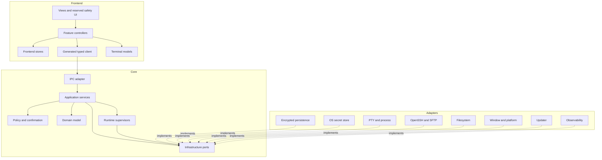

Views never call Tauri or Rust modules directly. Generated contracts contain
DTOs and client methods, not policy. Domain code has no Tauri, Tokio, SQL,
OpenSSH, React, or OS dependency. Adapters implement core-owned ports and do
not decide product policy. No module bypasses the secret service, persistence
writer, policy service, or operation registry. Terminal and file bytes never
enter React metadata stores.

## 2. Runtime architecture

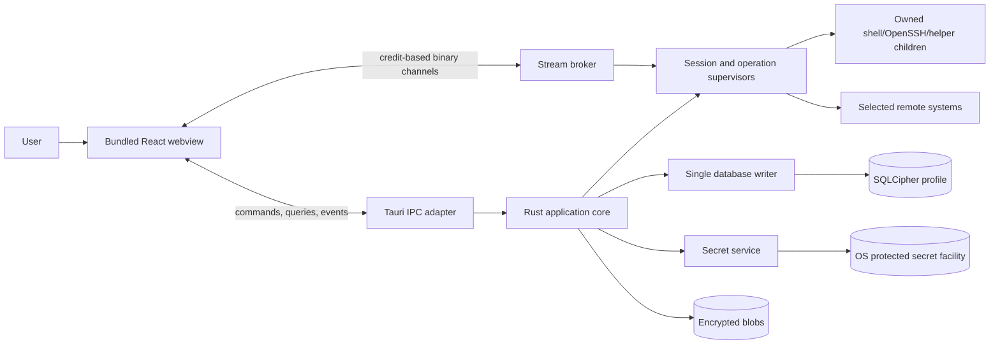

V1 has one primary desktop process and one primary webview. A second launch
connects to a randomized user-only local endpoint, authenticates with a
profile-scoped instance token, sends one bounded `LaunchIntent`, and exits.
Allowed intents are `focus`, `open_workspace(workspace_id)`, and
`open_local_terminal(profile_id?)`. Paths, commands, URLs, secrets, and remote
targets are rejected.

The application owns profile, session, operation, and window subscription
scopes. Each scope has cancellation, bounded queues, joined tasks, graceful
deadline, force-stop policy, and cleanup. Detached tasks are prohibited. Relio
has no v1 daemon.

## 3. IPC contract

### Message families

| Family | Meaning | Result |
| --- | --- | --- |
| Query | Bounded read with no mutation | Typed snapshot |
| Command | Validate intent and mutate once | Result or operation ID |
| Decision | Answer a core-issued confirmation | Accepted/rejected once |
| Event | Core fact after transition/commit | Ordered subscription |
| Stream | High-volume bytes with credit | Chunk/ack/close |

Every metadata message follows this conceptual schema:

```text
Request  = contract_version, request_id, window_id, profile_id?,
           expected_revision?, idempotency_key?, body
Response = contract_version, request_id, outcome(ok | error), body?
Event    = contract_version, subscription_id, aggregate_type, aggregate_id,
           sequence, occurred_at_utc, operation_id?, body
Error    = code, subsystem, operation_id?, retryable, user_action,
           safe_message_key, safe_parameters, diagnostic_id
```

The contract version is a major integer. Additive optional fields are
compatible. Unknown majors fail with `ipc.contract_unsupported`. Metadata has a
5 MiB absolute ceiling and should remain below 64 KiB. External side-effect
commands use an idempotency key scoped to profile, command, and target. Reuse
returns the prior terminal result without repeating work.

### Command and query inventory

| Namespace | Required operations |
| --- | --- |
| `app` | `get_bootstrap`, `get_capabilities`, `request_shutdown`, `cancel_shutdown`, `acknowledge_event_gap` |
| `profile` | `unlock`, `lock`, `get_status`, `rotate_key`, `export_recovery_backup` |
| `workspace` | `list`, `get`, `create`, `rename`, `archive`, `restore`, `set_active`, `apply_layout_patch`, `export_redacted` |
| `host` | `list`, `get`, `create`, `update`, `archive`, `test_connection`, `review_host_key` |
| `credential` | `list_metadata`, `register_reference`, `revoke`, `delete`, `request_reauthentication` |
| `session` | `create`, `connect`, `disconnect`, `reconnect`, `close`, `request_input`, `resize`, `set_recording`, `open_stream` |
| `transfer` | `preflight`, `start`, `pause`, `resume`, `cancel`, `resolve_conflict`, `list` |
| `remote_file` | `list`, `open`, `save`, `save_as`, `reload`, `discard_buffer` |
| `tunnel` | `preflight`, `start`, `stop`, `list` |
| `settings` | `get_schema`, `get_effective`, `set`, `reset`, `preview`, `commit_preview`, `cancel_preview`, `export_redacted` |
| `theme` | `list`, `get`, `create_draft`, `update_draft`, `validate`, `preview`, `commit`, `delete_draft` |
| `snippet` | `list`, `create`, `update`, `archive`, `prepare_insert`, `confirm_insert` |
| `history` | `search`, `delete`, `set_retention` |
| `recording` | `list`, `open_stream`, `delete`, `export` |
| `search` | `query`, `cancel` |
| `diagnostics` | `get_health`, `preview_bundle`, `export_bundle` |
| `update` | `check`, `download`, `cancel`, `install_when_safe` |
| `confirmation` | `decide` |

There are no generic process, shell, SQL, filesystem, URL-fetch, secret-read,
or updater-install commands.

### Confirmations, events, and streams

The Rust policy service creates a challenge containing a random nonce,
operation ID, normalized target/scope, risk class, expiry, re-authentication
requirement, and digest of immutable request fields. Reserved bundled React UI
renders it. A decision returns nonce, displayed digest, and choice. Rust
revalidates policy, revision, expiry, and digest and consumes the nonce once.
The frontend cannot create or self-approve a challenge.

Aggregate event sequences start at 1 and strictly increase. Events publish only
after a durable commit or live in-memory transition. A sequence gap marks the
cache stale; the client fetches a fresh snapshot and resumes from its sequence.

`open_stream` returns a stream ID, content type, initial sequence, chunk limit,
credit window, and gap policy. The consumer grants byte credit. Chunks contain
stream ID, sequence, flags, and bytes. Close occurs exactly once with
`completed`, `cancelled`, `owner_closed`, `source_closed`, `overflow_gap`, or a
typed error. The first adapter uses Tauri bounded channels behind this
framework-neutral broker. Terminal chunks are at most 64 KiB. General events
never carry terminal or file content.

## 4. Frontend state architecture

| Store | Authority | Content | Persistence |
| --- | --- | --- | --- |
| Bootstrap | Core | lock, capabilities, versions, startup health | none |
| Entity cache | Core | workspace/host/settings/theme DTOs and revisions | query again |
| Workbench | Shared | active workspace, pane tree, selection, pending patch | through core |
| Operation | Core | progress, confirmations, safe errors | none |
| View | Frontend | focus, menus, filters, unsubmitted drafts | none |
| Terminal registry | Runtime/model | terminal references, attachment, stream cursor | none |

Feature controllers alone write feature stores. Components dispatch intent and
select derived values. Optimism is limited to reversible presentation state.
Host, credential, transfer, tunnel, remote-write, archive, and committed
settings/theme state update only after core acceptance. Mutations include an
expected revision; a conflict returns current revision and safe summary.
Closing a view cancels its subscriptions, not its session. Terminal output goes
directly to the terminal model without a React render per chunk.

## 5. Rust backend architecture

| Module | Owns |
| --- | --- |
| `contract` | DTOs, codes, schema generation |
| `domain` | entities, value objects, state machines, invariants |
| `application` | use cases, transactions, authorization coordination |
| `policy` | capabilities, confirmation, limits, security decisions |
| `runtime` | supervisors, operations, cancellation, streams |
| `persistence` | repositories, migrations, writer task, outbox |
| `secrets` | handles, leases, OS-store ports |
| `terminal` | PTY/session orchestration and recording taps |
| `ssh` | OpenSSH capability/config/process and SFTP adapters |
| `files` | path models, listing, transfer, remote-save orchestration |
| `platform` | keychain, window, lock, picker, process-group, ACL adapters |
| `observability` | structured logs, metrics, audit facts, redaction |
| `update` | verified checking, staging, safe installation |
| `desktop` | Tauri composition and capability registration |

Traits live with their core consumer. Application transactions never hold
database locks while waiting for UI, network, or children. External work uses
prepare/execute/finalize: snapshot validated revision, perform cancellable work,
then finalize with a conflict check.

## 6. Data ownership rules

| Data | Authority | Durable location | Frontend |
| --- | --- | --- | --- |
| Profile/schema | Persistence service | SQLCipher | status only |
| Workspace/host/settings/theme | Repositories | SQLCipher | DTO + revision |
| Credential bytes/root key | Secret service/OS | OS protected store | never |
| Credential references | Credential repository | SQLCipher | redacted metadata |
| Live process/session | Session supervisor | memory | state/control |
| Restore descriptor | Workspace repository | SQLCipher | bounded DTO |
| Terminal bytes | Runtime + terminal model | memory; recording only by opt-in | stream |
| Transfer | Supervisor + summary repository | memory + resumable metadata | progress |
| Remote edit buffer | Editor controller | memory only | active buffer |
| Recording/log | Recording/log service | encrypted blob + metadata | explicit stream |
| Confirmation | Policy/operation registry | memory; final audit fact | challenge |

Only the persistence writer mutates SQLite. Reads use bounded snapshot
connections. Durable entities use optimistic revisions. Cross-aggregate writes
use one unit of work. A transactional outbox publishes committed events and is
drained idempotently on startup.

## 7. Event flow

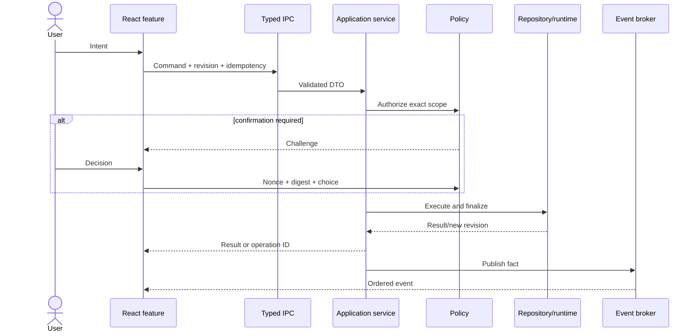

Long operations return acceptance before completion. Progress is coalesced to
at most ten metadata updates per second and completion is emitted once.

## 8. Startup lifecycle

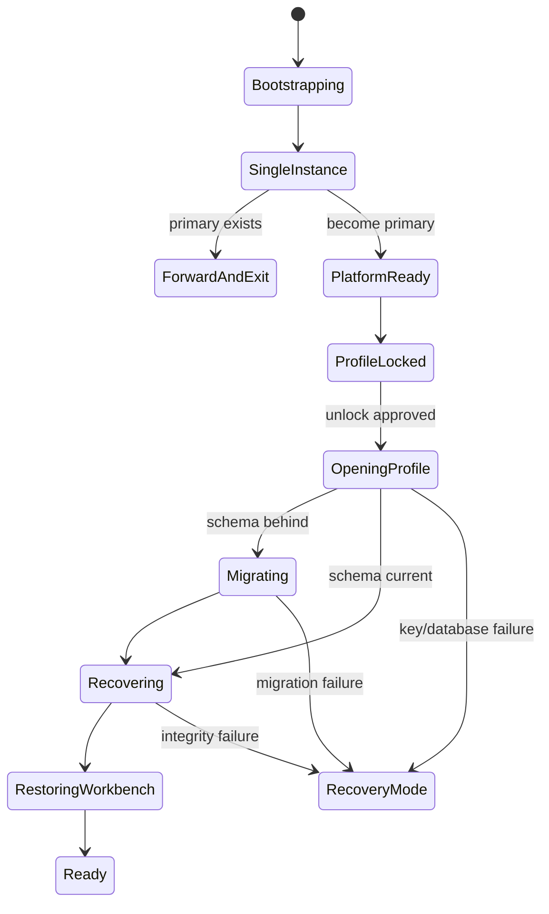

Order: minimal local logger; instance ownership; compiled capabilities;
window/bundled assets/CSP; locked bootstrap; profile key; database open and
integrity; verified migration and encrypted backup; outbox/incomplete-operation
and owned-temp recovery; safe settings/theme; active workspace descriptors;
`app.ready`. Startup performs no network request, SSH launch, update check, or
session restoration without user intent. Recovery mode allows diagnostics,
backup restore, and safe exit but no remote action.

## 9. Shutdown lifecycle

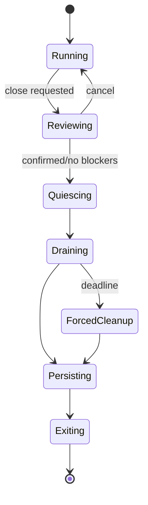

Review blockers: dirty remote buffers, transfers, tunnels, recordings, and
migrations. There is no background-daemon choice. Quiescing rejects new work,
then cancels operations, stops tunnels, terminates sessions, finalizes
authenticated segments, saves descriptors/final states, checkpoints, revokes
leases, removes owned endpoints, and releases the profile lock. The default
grace period is 10 seconds; children receive 3 seconds before forced stop.
Protected migration/rotation reaches a safe checkpoint before exit. Forced OS
termination is recovered at startup.

## 10. Connection lifecycle

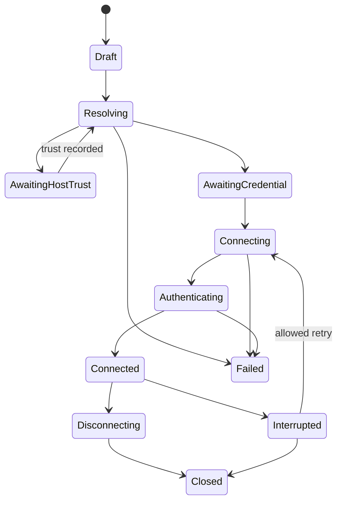

Resolution creates an immutable effective plan: visible target, jump chain,
proxy, algorithms, identity, credential reference, forwarding decision, and
provider version. Trust and credentials are separate decisions. At most three
automatic retries use capped exponential backoff and only transient errors;
authentication, host-key, policy, and cancellation never retry. A test
connection authenticates and probes, then disconnects; it stores an expiring
result, creates no session, and never silently modifies host trust.

## 11. Session lifecycle

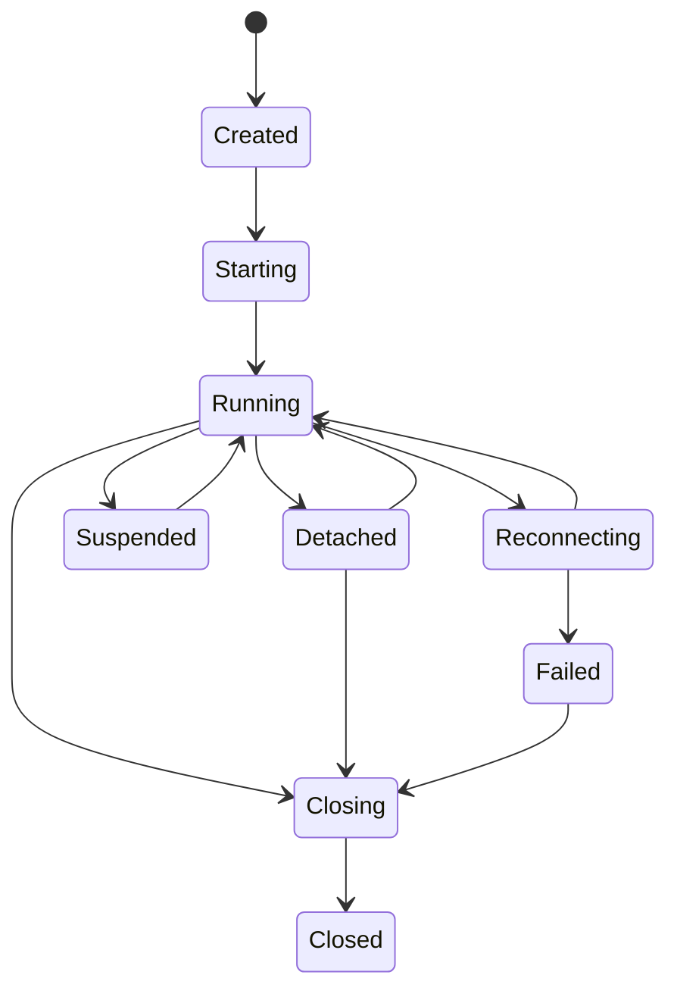

Starting owns one child/transport. Running has one input writer and bounded
observers. Input sequences reject duplicates; resize is last-value-wins.
Detaching keeps the frontend terminal model; webview loss leaves a bounded core
replay window. Defaults allow 32 live sessions per profile and 10 visible panes
per workspace. Closing a pane closes its last-owned session only after applying
the explicit close policy. Restore creates a new session from metadata and
never claims PID, channel, scrollback, or process continuity.

## 12. Theme loading lifecycle

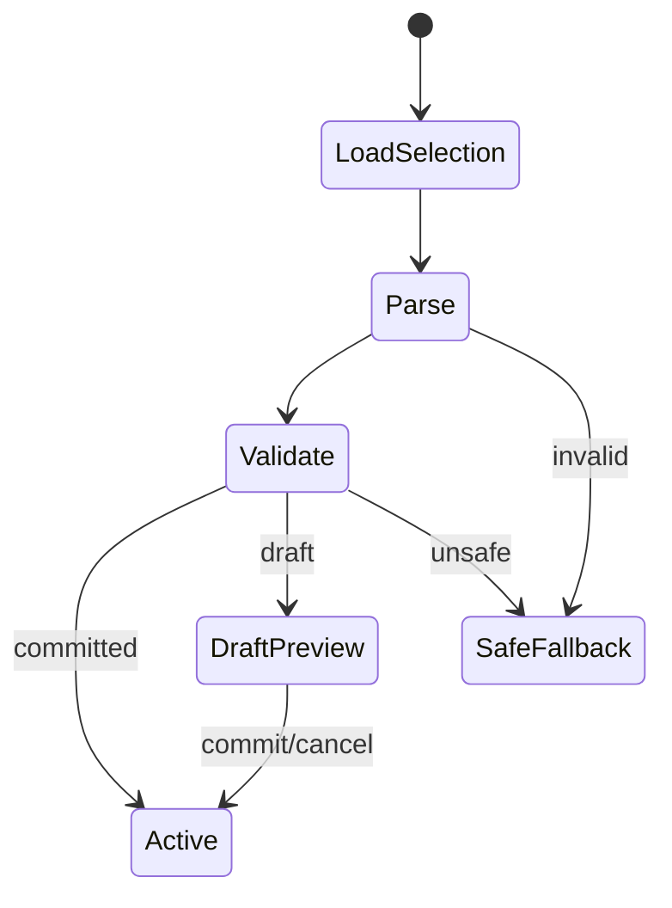

Compiled safe tokens render before profile access. Parsing enforces schema,
count, length, color, font, contrast, and asset limits. Themes cannot change
safety chrome, visibility, z-order, confirmations, CSP, or remote resources.
Preview is window-scoped memory with no crash persistence. Commit is
transactional and revisioned. Invalid persisted state is quarantined and the
safe fallback does not block startup.

## 13. Workspace lifecycle

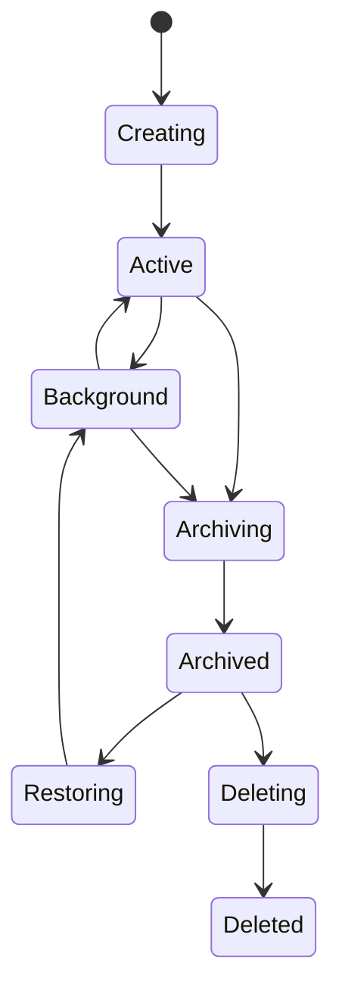

Creation atomically commits identity, name, empty layout, and revision. Layout
patches use a base revision, debounce for 250 ms, validate a bounded acyclic
tree, and commit transactionally. Conflict returns authoritative layout; only
still-valid focus intent is replayed. Archive first resolves live sessions,
transfers, tunnels, and dirty edits. It never deletes shared hosts, credentials,
snippets, recordings, or external files. Permanent deletion is a separate
confirmed impact-preview operation.

## 14. Settings lifecycle

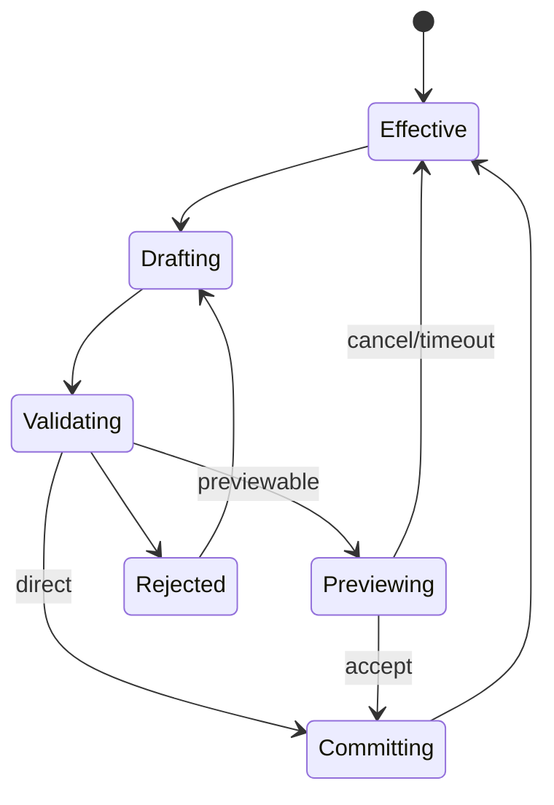

Precedence: compiled, platform, profile, workspace, session. Every key declares
type, scope, default, limits, sensitivity, restart need, previewability, and
owner. Unknown compatible keys are preserved but not applied. Secrets are not
settings. Multi-key changes validate and commit atomically with revisions.
Preview is a 30-second in-memory overlay and cannot cover security policy,
encryption, credentials, or update trust. Restart-only changes persist as
pending without mutating the current runtime.

## 15. File transfer lifecycle

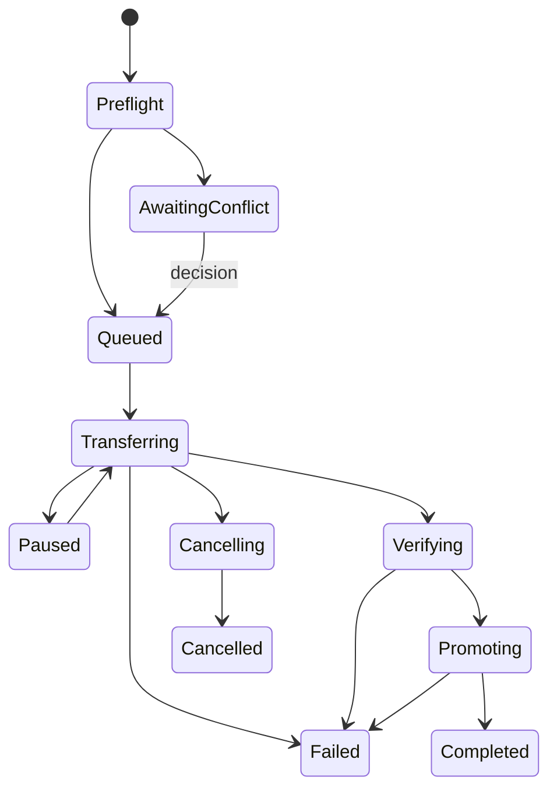

Preflight binds source identity, exact destination, direction, expected
destination identity, conflict/symlink policy, size, space where knowable, and
capabilities. Writes use owner-tagged random temporary files in the destination
directory. Promotion uses no-replace or atomic replace when supported; weaker
guarantees require disclosure. Existing targets require skip, rename, or
confirmed replace. Verification uses size/metadata and hashes only when both
sides can compute them without unreviewed remote execution.

Pause/resume appears only when source and partial identities can be revalidated.
Otherwise pause is cancellation plus partial cleanup. Limits are four active
transfers per profile, two per host, and 100 queued. Restart marks incomplete
work `interrupted` and never resumes automatically; owned temporary files are
offered for retry or deletion.

## 16. Remote editing lifecycle

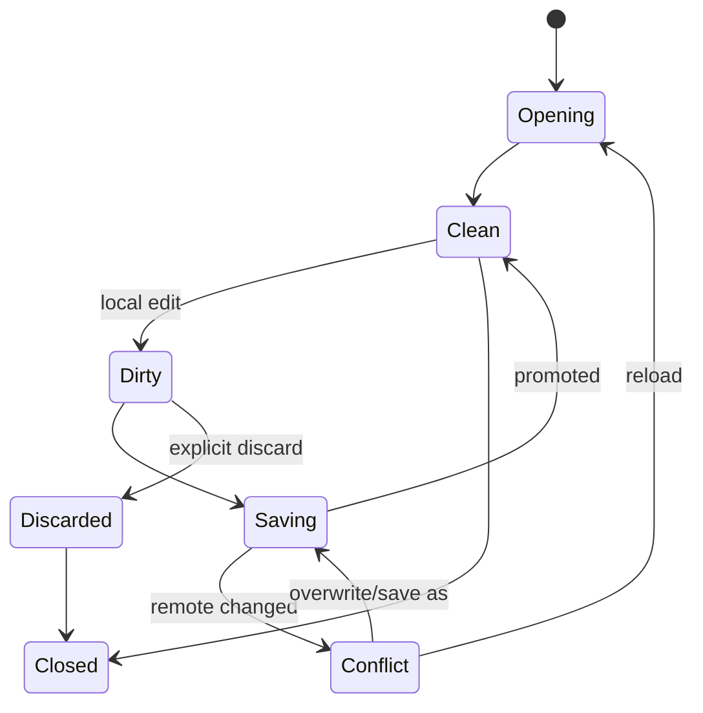

V1 edits plain text up to 10 MiB decoded, rejects NUL/binary content, and has no
external-editor handoff. Buffers are memory-only and absent from crash recovery,
logs, and recordings. Opening records the strongest provider identity:
provider file ID, or canonical path/type/size/high-resolution mtime plus bounded
content hash. Save revalidates and enters Conflict on mismatch.

Save writes an owner-tagged sibling temporary file, applies documented
permissions, verifies, and atomically promotes where available. Weaker
replacement requires confirmation. Dirty close requires save, discard, or
cancel. Crash loses unsaved content by design and the UI states this before the
first edit.

## 17. Error propagation

Codes use `subsystem.category.detail`, such as `ssh.host_key.changed`.
Categories are `invalid`, `conflict`, `denied`, `unavailable`, `timeout`,
`cancelled`, `corrupt`, `exhausted`, and `internal`. Adapters retain diagnostic
causes and map once at the application boundary. UI receives safe localization
keys and recovery actions, never raw provider messages. Retryability is
explicit. Cancellation is not failure unless cleanup fails. Authentication and
integrity errors fail closed. Every operation reaches one terminal outcome;
late results after cancellation are ignored.

## 18. Logging strategy

Structured local logs contain UTC time, monotonic offset, severity, subsystem,
event code, diagnostic/operation/session/transfer IDs, platform, version, and
typed redacted fields. They never contain secret bytes or handles, terminal
content, file content, raw commands, headers, full private paths, or unredacted
host/user values. Correlation uses profile-keyed pseudonymous hashes.

Operational logs are encrypted with 14-day default retention. Security audit
facts—trust decisions, broad binds, credential-reference changes, exports, and
update verification—default to 90 days. Session recording is a separate opt-in
sink. Logs rotate at five 10 MiB files by default. Stable debug logging cannot
disable redaction. Support bundles are local, allowlisted, redacted, previewed,
and explicitly exported. Audit persistence failure blocks only operations whose
policy requires an audit fact.

## 19. Testing architecture

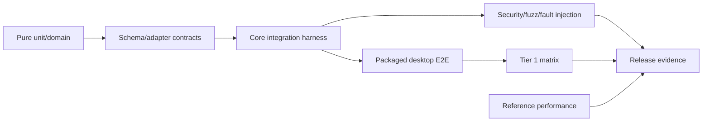

The integration harness owns fake time/randomness, event collection, temporary
encrypted profiles, fake keychains and PTYs, controlled OpenSSH/SFTP, and a
fault-injecting filesystem. Rust generates contract fixtures consumed by
TypeScript; stale or breaking schemas fail CI. Every lifecycle transition and
invalid transition gets a state-table test. Repositories test against the
production encrypted SQLite build. Platform adapters share conformance suites.
E2E runs packaged artifacts with semantic accessibility selectors.

CI lanes are: fast presubmit (format, lint, types, unit, contract); platform
presubmit (build, integration, smoke); scheduled (compatibility, fuzz, soak,
audits); protected release (clean offline build, migration, E2E, security,
performance, package/sign/verify). Security-boundary tests cannot be
quarantined as flaky.

## 20. Build architecture

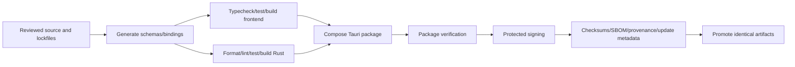

Use a pnpm workspace and Cargo workspace. The desktop composition root depends
on core and adapters; adapters never depend on desktop. Generated TypeScript
contracts are freshness-checked artifacts, not hand-edited definitions.

The first scaffold pins Rust, Node LTS, pnpm, Tauri, target triples, encrypted
SQLite, crypto provider, and lockfiles. Release builds use clean source,
verified/vendored dependencies, no uncontrolled fetch, and embed revision,
contract/schema versions, channel, target, and build identity. Developer builds
use distinct IDs, profiles, keys, and update origins.

Build natively on protected Windows, macOS, and Linux runners.
Cross-compilation is not signing/notarization evidence. Build/test receives no
signing keys. Signing consumes tested immutable artifacts; channel promotion
changes metadata, not binaries. Publish checksums, relevant platform and update
signatures, CycloneDX SBOM, provenance, notices, and install/upgrade/uninstall
verification.

## Versioned limits

| Limit | v1 default |
| --- | ---: |
| IPC metadata | 5 MiB absolute; 64 KiB target |
| Terminal chunk | 64 KiB |
| Live sessions/profile | 32 |
| Visible panes/workspace | 10 |
| Active transfers/profile | 4 |
| Active transfers/host | 2 |
| Queued transfers/profile | 100 |
| Remote edit decoded content | 10 MiB |
| Progress events/operation | 10/second |
| Settings preview | 30 seconds |
| Graceful shutdown | 10 seconds |
| Child termination before force-stop | 3 seconds |

Every parser, collection, queue, replay buffer, directory page, search result,
log, recording, temporary file, retry loop, and helper prompt must also declare
a named limit before its feature merges. Missing limits fail policy validation
in development and CI.
