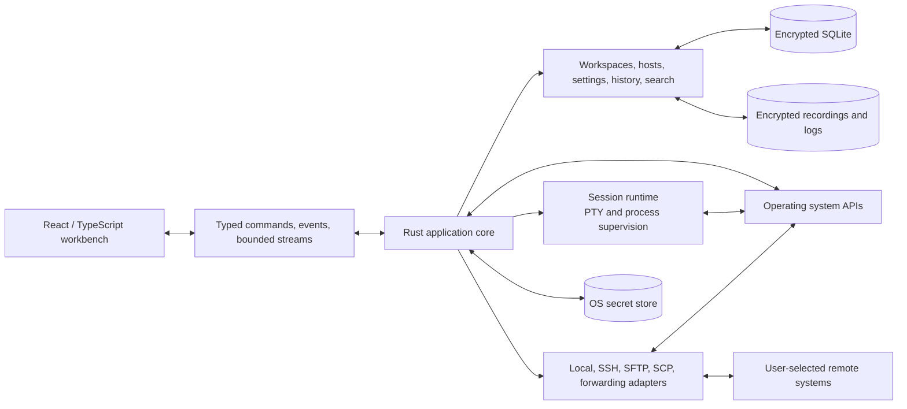

# Architecture Overview

## Decision in one sentence

Use a Tauri 2 desktop shell with a React/TypeScript workbench and a Rust
application core, keeping OS access, authorization, process supervision,
terminal transports, persistence, updates, and security-sensitive work out of
the frontend.

## Why this shape

Relio needs a rich keyboard-first UI plus systems access to PTYs, shells, SSH,
files, sockets, keychains, and native windows. Rust fits the long-lived core
because it provides strong memory/concurrency guarantees and one cross-platform
backend. React and TypeScript fit rapid workbench/design-system development.
Tauri supplies the desktop bridge without shipping a separate browser runtime
with every installation.

The split has costs. System webviews differ, IPC can become a bottleneck, and a
web frontend can consume excessive memory if terminal output enters ordinary
state. Relio therefore keeps high-volume bytes on bounded streams, limits every
IPC payload, and measures startup, rendering, memory, input latency, and idle
cost on every supported platform.

## System shape

All application behavior is compiled and shipped with Relio. The product loads
no remote application code or executable functionality at runtime.

## Runtime layers

### Presentation

React components render views and collect intent. They do not spawn processes,
read arbitrary files, store credentials, connect sockets, install updates, or
call protocol libraries directly.

### Application

Rust application services translate intent into use cases, enforce scope and
confirmation policy, coordinate repositories/adapters, and publish typed facts.
This is the stable boundary between UI and operating-system authority.

### Domain

Domain models describe workspaces, hosts, sessions, panes, snippets, history,
recordings, settings, themes, transfers, tunnels, and operations. Domain code
is testable without a window, network, keychain, or database.

### Infrastructure

Adapters implement PTY access, supported OpenSSH commands, SFTP/SCP, port
forwarding, encrypted SQLite repositories, encrypted blob storage, OS secret
facilities, filesystem operations, logging, and updates.

## Process model

The trusted Rust process and less-trusted webview are the only long-lived
application processes. Supervised children are created only for:

- local shells and PTYs;
- supported OpenSSH commands;
- narrowly scoped askpass or platform helpers.

Every child and asynchronous task has an owner, bounded channels, cancellation,
shutdown deadline, forced-stop fallback, and reaping responsibility. Relio v1
has no background daemon.

See [IPC and process model](ipc-and-process-model.md).

## Boundary rules

1. UI code depends on generated application contracts, never Rust
   implementation modules.
2. Domain code depends on interfaces, never Tauri, SQLite, OpenSSH, or OS APIs.
3. Infrastructure adapters do not decide product policy; application services
   do.
4. Terminal/transfer streams are separate from metadata state.
5. Secrets are opaque handles until the core acquires a purpose-bound lease.
6. Every event has an owner, lifecycle, order rule, and bounded payload.
7. Every queue, cache, stream, session, transfer, and retry loop has a limit.
8. Themes, SSH configuration, remote paths/output, and backup files are
   untrusted input.
9. Security-relevant confirmation is core-owned and bound to the exact
   operation.
10. Public transfer/export formats are smaller and more stable than internal
    database/IPC representations.

## Core domain concepts

- **Workspace:** local composition and layout plus references to host profiles,
  sessions, remote-file views, snippets, and retained records.
- **Host:** connection metadata and credential references, never credential
  bytes.
- **Session:** live or restorable metadata for a local shell or SSH transport.
- **Pane:** visual container for one session or core tool surface in a layout
  tree.
- **Operation:** user-visible connect, transfer, remote-save, tunnel, or
  command action with one terminal result.
- **Transport capability:** behavior reported by an adapter, such as
  interactive SSH, SFTP, SCP, or a forwarding direction.
- **Recording:** opt-in encrypted terminal stream segments and derived index
  metadata.
- **Theme:** validated local semantic token data.

## Deliberate simplifications

- one desktop authority process and one database writer;
- no local server or multi-process indexer;
- no exact process resurrection after restart;
- no general-purpose code editor;
- no support promise for every remote protocol or OpenSSH directive;
- no runtime-loaded application modules;
- no network-owned workspace state.

These constraints reduce attack surface and operational cost and must not be
undermined by speculative abstractions.

## Implementation baseline

The complete reviewed constraints are in the
[technical blueprint](technical-blueprint.md), with focused detail in:

- [workspace architecture](workspaces.md);
- [persistence architecture](persistence.md);
- [terminal architecture](terminal.md);
- [SSH architecture](ssh.md);
- [theme system](theme-system.md);
- [performance and capacity](performance-and-capacity.md);
- [platform support](platform-support.md).
