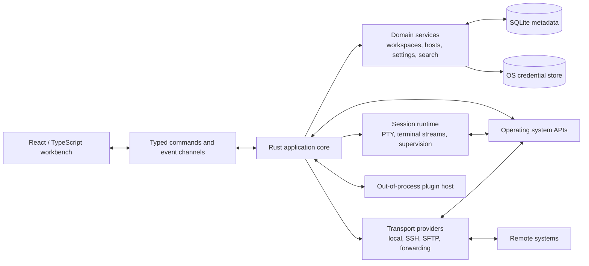

# Architecture Overview

## Decision in one sentence

Use a Tauri 2 desktop shell with a React/TypeScript workbench and a Rust application core, keeping OS access, process supervision, terminal transports, persistence, and security-sensitive work out of the frontend.

## Why this shape

The product needs a rich, rapidly iterated UI and systems-level access to PTYs, shells, SSH, files, sockets, keychains, and native window behavior. Rust is a good fit for the long-lived core because it gives us strong memory and concurrency guarantees and produces a single cross-platform native backend. React and TypeScript fit the contributor profile and make design-system work fast. Tauri provides the desktop bridge without requiring every installation to ship a second browser engine.

This is a pragmatic split, not a claim that web UI is free. The design therefore keeps high-volume terminal data on streaming channels, limits IPC payloads, and measures startup, render, memory, and idle behavior on all supported platforms.

## System shape

## Runtime layers

### Presentation layer

React components render views and collect intent. They do not spawn processes, read arbitrary files, store credentials, or call protocol libraries directly.

### Application layer

Rust application services translate user intent into use cases, enforce authorization and capability checks, coordinate repositories and providers, and publish typed events. This layer is the stable boundary between UI and infrastructure operations.

### Domain layer

Domain models describe workspaces, sessions, panes, hosts, snippets, recordings, settings, and operations. Domain code should be testable without a window, network, or database.

### Infrastructure layer

Adapters implement PTY access, OpenSSH/native SSH providers, SFTP, port forwarding, SQLite repositories, OS keychain access, filesystem operations, logging, and update services.

### Extension layer

Plugins run outside the trusted core and communicate over a versioned protocol. They contribute commands, views, detectors, providers, snippets, and themes through declared capabilities.

## Boundary rules

1. UI code depends on typed application contracts, never on Rust implementation modules.
2. Domain code depends on interfaces, never on a concrete database or operating system.
3. Infrastructure adapters do not decide product policy; application services do.
4. Transport streams are separate from metadata state.
5. Secrets are referenced by opaque handles and never represented as ordinary settings values.
6. Plugins cannot mutate core state except through an approved capability.
7. Every event has a documented owner and lifecycle.
8. Public extension APIs are smaller than internal APIs and are versioned separately.

## Core domain concepts

- **Workspace:** a user-defined context containing projects, hosts, sessions, snippets, files, detectors, and layout.
- **Host:** connection metadata and references to credentials, not the credentials themselves.
- **Session:** a live or restorable interaction with a local shell or remote transport.
- **Pane:** a visual container for one session within a layout tree.
- **Operation:** a user-visible action such as connect, upload, forward a port, or run a detector.
- **Provider:** a protocol or integration implementation behind a capability contract.
- **Contribution:** a plugin-provided command, view, detector, provider, theme, or content type.

## Explicitly deferred

- multi-process workspace indexing;
- remote collaboration;
- background cloud agents;
- a general-purpose code editor;
- support for every SSH implementation detail in native Rust;
- dynamic plugin UI with arbitrary frontend code.

These may become valid later, but they should not shape the first core unnecessarily.
