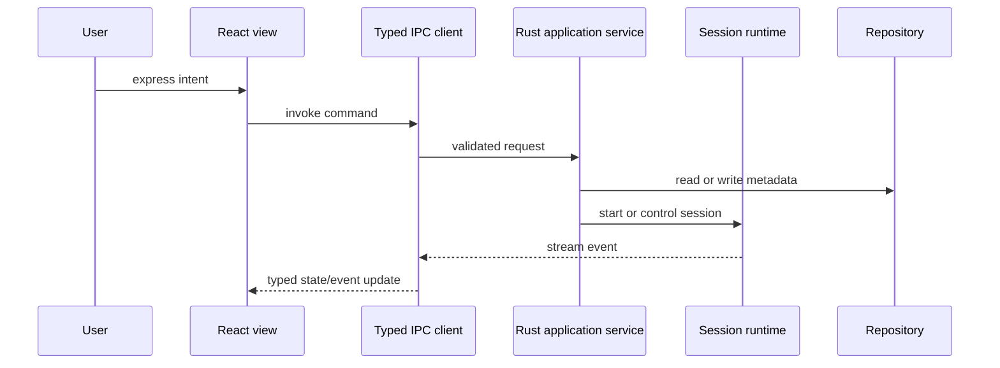

# State Management

## Principle

State belongs to the smallest layer that can own it. The application must not create one global store containing UI state, domain state, live terminal bytes, and secrets.

## State categories

| Category | Owner | Persistence | Examples |
| --- | --- | --- | --- |
| Ephemeral view state | React component or feature store | No | Dialog open, focused control, filter text |
| Workbench state | Frontend workspace controller | Yes, through app service | Active workspace, pane tree, active tab |
| Domain metadata | Rust application services and repositories | Encrypted SQLite | Hosts, snippets, recording indexes, settings |
| Live session state | Session runtime | Snapshot/metadata only | PTY status, dimensions, connection state |
| Terminal bytes | Session runtime stream and frontend terminal model | Only when explicitly recording | Input/output stream, scrollback |
| Secrets | OS credential store | Yes, never in ordinary state | Passwords, key passphrases, profile keys |

## Data flow

High-volume terminal data uses a stream/channel with backpressure and batching. It must not pass through a general-purpose metadata store or trigger a full workbench render for every byte.

The terminal model may outlive its mounted DOM renderer. If the entire frontend
disconnects, the runtime retains only a bounded replay window and applies the
provider's documented backpressure/degraded-session policy. Relio does not claim
unlimited detached scrollback or exact process recovery.

## Event rules

- Events describe facts that happened, not UI instructions.
- Event names include the owning aggregate or subsystem.
- Events carry stable IDs and timestamps where ordering matters.
- Ordered event streams carry a monotonic sequence; wall-clock timestamps are
  diagnostic metadata, not the ordering source.
- Consumers handle unknown event fields for forward compatibility.
- A failed operation has a typed error and a user-safe message; raw diagnostics remain available to logs.

## Persistence rules

- Writes are transactional and migrated forward with an explicit schema version.
- The last known layout is saved incrementally but debounced.
- Live processes are not assumed to survive application restart.
- Restoration must degrade gracefully when a host, file, or executable is unavailable.
- Export is versioned and always redacts secret handles and bytes.
- One persistence service serializes database writes and holds the profile
  writer lock.
- Large recordings use encrypted segmented files with metadata in SQLite.
- Every cache and queue has an owner, size limit, eviction policy, and
  observability metric.
