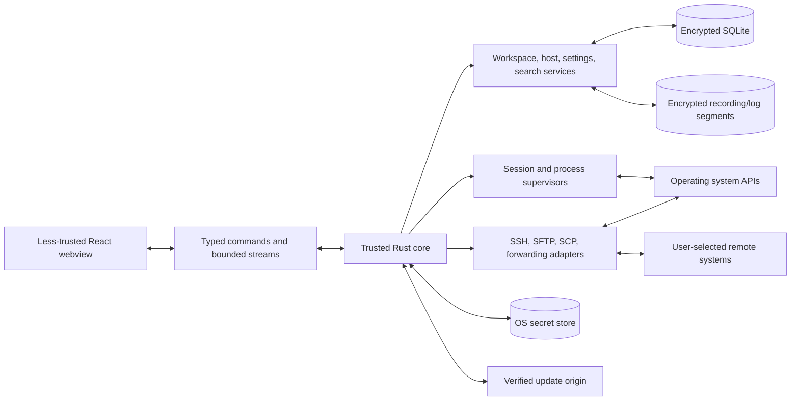

# Technical Blueprint and Architecture Review

- Review date: 2026-07-29
- Scope: every repository document and repository-level configuration file
- Status: Relio v1 implementation baseline

This is the entry point for implementation. Focused documents remain
authoritative for their subsystems.

## Executive decision

Relio v1 is a local-first Tauri 2 desktop application with a
React/TypeScript workbench and a Rust authority process. It is deliberately a
focused SSH and terminal product:

- local and SSH terminal sessions;
- tabs, split panes, session and workspace restore;
- host and secure credential management;
- SFTP and SCP transfer, remote browsing, and conflict-aware editing;
- local, remote, and dynamic port forwarding;
- command history, snippets, command palette, search, logs, and opt-in
  recording;
- a built-in local theme engine and keyboard-first accessible UI.

All application behavior ships with Relio and is reviewed together. V1 loads no
runtime application modules, remote UI code, or installable functionality.
This smaller trusted codebase is an intentional security and maintainability
decision.

## Review findings and disposition

| Assumption or gap | Finding | V1 disposition |
| --- | --- | --- |
| SQLite plus file permissions protects local operational data | Host inventories, snippets, and recordings remain sensitive on a copied profile | Use encrypted SQLite with a random key in the OS secret store; encrypt large retained content separately |
| “Workspace” is self-explanatory | Ownership, deletion, portability, and host reuse were ambiguous | Use one local aggregate with explicit references and lifecycle; provide redacted export but no portable import or local project-root authority in v1 |
| One OpenSSH subprocess satisfies every remote feature | Interactive SSH, SFTP, SCP, and forwarding have different capabilities and lifecycle | Use capability-reporting adapters; run a bounded SFTP protocol over a separate supervised OpenSSH subsystem and diagnose SCP semantics explicitly |
| A detached terminal can be replayed without limit | Without a backend emulator, unlimited replay creates memory and correctness problems | Keep the frontend model alive for DOM detach; use bounded replay and explicit backpressure |
| Theme data is harmless | Arbitrary CSS, scripts, assets, and remote resources would create a second code/content loading path | Limit v1 to validated local semantic tokens edited through core UI |
| Cross-platform means identical behavior | PTYs, webviews, keychains, filesystems, and process trees differ | Use platform adapters and a tiered release matrix |
| Security can wait for final hardening | Late changes to secrets, migrations, SSH trust, and updates would alter core formats | Enforce security gates in every milestone |
| One package per domain improves architecture | Premature extraction adds dependency and versioning cost | Start with cohesive desktop modules and extract only proven process/security/build boundaries |

## System invariants

- The Rust core is the sole authority for processes, files, credentials,
  persistence, transports, listeners, and updates.
- The webview loads bundled assets only, receives no secret bytes, and has no
  generic filesystem, shell, network, database, or updater-install command.
- Every external operation has an operation ID, target, initiating user action,
  cancellation policy, terminal result, and privacy-safe diagnostic.
- Commands cross a typed deny-by-default boundary. Terminal and transfer bytes
  use separate bounded streams.
- Secrets are acquired as purpose-bound short-lived leases. A secret handle is
  not authority.
- Workspaces contain local records and references, never credential bytes or
  local filesystem authority.
- SSH configuration, theme settings, database backups, and remote output are
  untrusted input.
- Unknown host keys require explicit verification. Changed or revoked keys fail
  closed.
- Network listeners bind to loopback by default; broader binds show exact
  exposure before activation.
- Remote writes show target, conflict/overwrite state, and available atomicity.
- Every queue, cache, stream, session, transfer, and retry loop is bounded.
- No migration, update, recovery restore, or theme activation replaces the previous
  known-good state before validation.

## Runtime shape

The webview and Rust core are the only long-lived application processes. Local
shells, OpenSSH commands, and narrowly scoped helpers are supervised children.
There is no additional application runtime or background daemon.

## Ownership map

| Concern | Sole authority | Durable representation |
| --- | --- | --- |
| Workspace composition and layout | Workspace service | Encrypted database |
| Host identity and transport preferences | Host service | Encrypted database; secret handles only |
| Live session/process state | Session supervisor | Metadata snapshot only |
| Terminal rendering and scrollback | Frontend terminal model | None unless retention is enabled |
| Credentials and profile encryption keys | Secret service adapter | OS secret store |
| Settings and local theme records | Settings/theme service | Encrypted database |
| Snippets, history metadata, and search indexes | History/search service | Encrypted database |
| Recordings and large logs | Recording service | Encrypted immutable segments plus database index |
| Updates | Core update service | Signed metadata, staged artifact, local result |

## Data and contract decisions

- Use one encrypted application database and one writer process per local
  profile.
- Use stable opaque IDs; labels and paths are never identity keys.
- Use forward-only transactional migrations with encrypted pre-migration
  recovery copies.
- Keep large recordings and logs outside SQLite; keep their authenticated
  metadata and search index in the database.
- Generate frontend DTOs from one canonical Rust/schema source. Handwritten
  duplicate IPC types are prohibited.
- Version database, settings, theme, export, backup, and encrypted blob formats
  independently from the application.
- Export uses a versioned redacted format, never a raw database copy. V1 has no
  portable workspace or theme ingestion path.

## Scalability model

Relio scales up on one workstation. It targets thousands of local records,
tens of sessions, and large retained history with bounded resources. It does not
need microservices, distributed locks, a server database, a local daemon fleet,
or network-owned workspace state.

Concrete budgets and datasets are in
[performance and capacity](performance-and-capacity.md).

## Implementation gates

### Foundation

Before application scaffolding:

- accept architecture and security ADRs;
- select the project license;
- name Tier 1 platform targets;
- name owners for security reports and release signing;
- define reference performance machines;
- approve licensing and maintenance for encrypted SQLite and other
  security-critical dependencies.

### Shell and local terminal

- restrictive CSP and explicit per-window Tauri capabilities;
- no generic privileged IPC;
- typed request/event/cancellation/error conventions;
- PTY process-tree ownership and cleanup;
- bounded terminal streams and adversarial escape-sequence tests;
- startup, input-latency, memory, and idle budgets.

### Persistence and workspaces

- encrypted database and keychain failure behavior on every Tier 1 platform;
- profile writer lock, migration, backup, corruption, key-loss, and downgrade
  tests;
- workspace create/archive/delete/reference semantics;
- redacted workspace/settings exports with no secret handles or bytes;
- no plaintext canaries in database, journal/WAL, temporary, backup, IPC, or
  logs.

### SSH and remote operations

- supported OpenSSH matrix and safe configuration subset;
- unknown, changed, revoked, and legacy host-key tests;
- one-time askpass channel with no credential in arguments, environment, logs,
  or webview;
- SFTP/SCP capability diagnosis and legacy-protocol refusal;
- bounded SFTP packet parsing, request correlation, and separate-connection
  behavior;
- transfer cancellation, path/symlink/conflict handling, and partial-write
  recovery;
- forwarding ownership, jump hosts, duplicate-listener prevention, and broad
  bind confirmation.

### History, search, recording, and themes

- retention is disabled until the user enables it;
- encrypted segmented recording, disk reserve, deletion, and index consistency;
- bounded search and privacy-safe support exports;
- theme token/schema/contrast validation and atomic fallback;
- trusted safety chrome remains invariant under every theme.

### Stable release

- governance blockers closed;
- Tier 1 install, update, data migration/rollback, and uninstall tests;
- signed artifacts and update metadata, checksums, SBOM, and provenance;
- independent review of IPC, credentials, encryption, SSH, remote file writes,
  listeners, and updates;
- accessibility and performance budgets pass on physical reference systems.

## Scope control

The current architecture includes only components required by the v1 feature
map. Future concepts are recorded separately and create no current dependency,
API, service, package, milestone, or compatibility requirement.

## Canonical document map

- [Architecture overview](overview.md)
- [IPC and process model](ipc-and-process-model.md)
- [Workspace architecture](workspaces.md)
- [Persistence architecture](persistence.md)
- [Terminal architecture](terminal.md)
- [SSH architecture](ssh.md)
- [Theme system](theme-system.md)
- [Performance and capacity](performance-and-capacity.md)
- [Platform support](platform-support.md)
- [Security architecture](../security/README.md)
- [Testing strategy](../operations/testing-strategy.md)
- [Roadmap](../roadmap.md)
