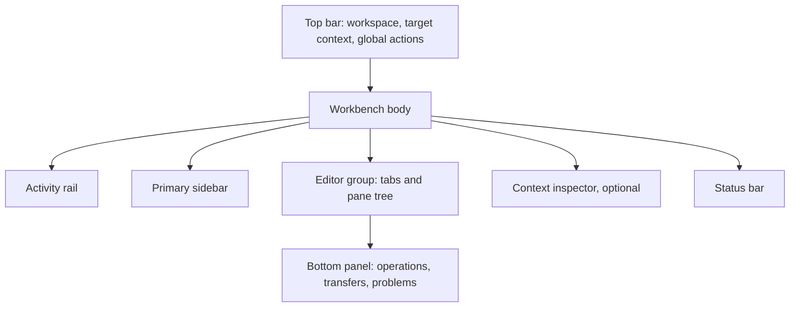
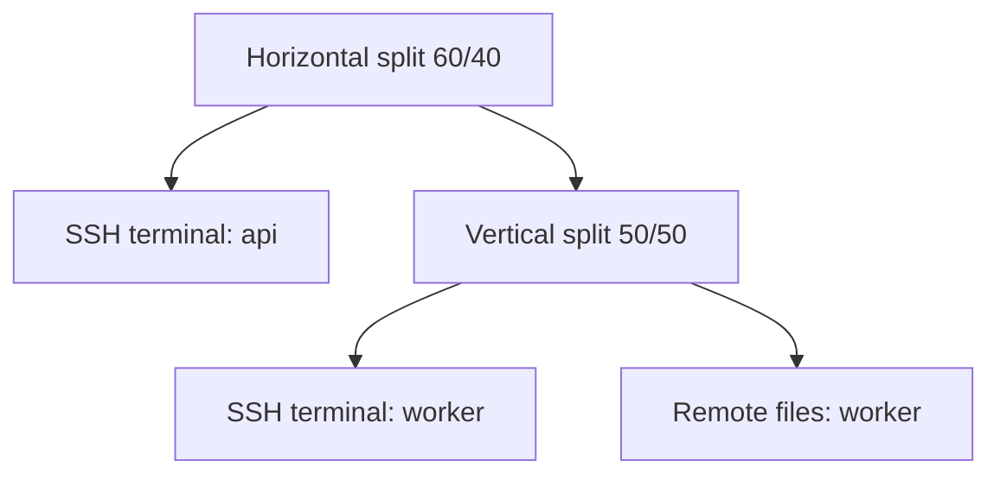

# Application Layout

## Window model

Relio v1 uses one primary workbench window. Native secure input or platform
pickers may open system-owned windows. The product does not rely on a fleet of
detached utility windows for core navigation.

The default workbench is a five-region layout:



The editor group owns the largest share of the window. Sidebar, inspector, and
bottom panel are independently collapsible. The activity rail, top context, and
status bar remain stable orientation anchors.

## Main window structure

```text
┌───────────────────────────────────────────────────────────────────────────┐
│ Window controls  Workspace / Active target             Search   Actions │
├────┬──────────────────┬──────────────────────────────────────┬────────────┤
│    │                  │ Tab strip                            │            │
│ A  │ Primary sidebar  ├──────────────────────────────────────┤ Context    │
│ c  │                  │                                      │ inspector  │
│ t  │                  │ Editor / split-pane tree             │ optional   │
│ i  │                  │                                      │            │
│ v  │                  ├──────────────────────────────────────┴────────────┤
│ i  │                  │ Operations / Transfers / Problems panel           │
│ t  │                  │ optional                                           │
│ y  │                  │                                                    │
├────┴──────────────────┴────────────────────────────────────────────────────┤
│ Workspace  Host/identity  Connection  Recording  Operations  Encoding    │
└───────────────────────────────────────────────────────────────────────────┘
```

## Top bar

The top bar combines platform window treatment with product orientation.

### Left

- application/window menu as appropriate to platform;
- current workspace switcher;
- navigation history when supported by the current view.

### Center

- active surface breadcrumb;
- remote host and environment badge for active remote surfaces;
- local indicator for local terminal surfaces.

The center may truncate labels visually but preserves complete accessible names
and exposes the full value in a tooltip or inspector. Production and changed
identity states must not truncate the state label itself.

### Right

- global search;
- command palette;
- layout controls relevant to the active surface;
- connection/operation action menu.

Frequently used actions should not appear both as several top-bar icons and a
second toolbar inside the surface. The surface toolbar wins for surface-owned
actions; the top bar keeps global and layout actions.

## Activity rail

- Fixed width within the design-system compact navigation range.
- Destinations: Workspaces, Hosts, Library, Settings.
- Bottom utilities: Operations state and profile/lock state.
- Active, hover, focus, notification, and unavailable states use shape and icon
  plus accessible text.
- Tooltips name icon-only destinations after a short delay; keyboard focus
  reveals them immediately.

The rail never changes meaning by workspace. Reordering is not part of v1.

## Primary sidebar

### Structure

1. domain title and primary action;
2. search/filter field;
3. virtualized navigation/list content;
4. optional contextual footer.

The sidebar can collapse to the rail. Its last user-selected width is saved
within allowed bounds. Resizing never causes the editor to fall below its
minimum usable width without switching to compact behavior.

### Selection and focus

Selection means navigation context; focus means keyboard target. Selecting a
host or workspace must not send focus or input to a terminal unless the user
activates that terminal.

## Tabs

### Anatomy

Each tab includes:

- type icon;
- concise name;
- remote environment marker when applicable;
- state marker for connecting, disconnected, dirty editor, or recording;
- close action.

The active tab uses more than color: surface fill, border relationship to the
editor, and accessible selected state. Dirty and recording states are distinct
in icon and label.

### Behavior

- Tabs can reorder within one group.
- Overflow becomes a searchable tab list; tabs do not shrink to illegible
  slivers.
- Middle-click close may follow platform convention but cannot bypass live
  session or dirty editor review.
- Closing the last tab shows the workspace Overview or empty editor state, not
  a blank unlabelled canvas.
- Tabs represent surfaces or named layouts. Splits live inside a tab.

## Terminal area

### Terminal pane anatomy

```text
┌─ api-prod · deploy ─ Connected ─ REC ────────────────────── [•••] ┐
│                                                                  │
│  terminal renderer                                               │
│                                                                  │
│                                                                  │
├──────────────────────────────────────────────────────────────────┤
│ optional in-pane find/status overlay, never shell input chrome    │
└──────────────────────────────────────────────────────────────────┘
```

The pane header is compact but persistent for remote sessions. For a single
local terminal, it may reduce to a slim label; remote target, environment,
identity, changed/disconnected state, and recording status must remain
discoverable without hovering.

### Input ownership

- The active terminal has a visible pane focus treatment.
- Application shortcuts that intercept terminal input are documented and
  editable.
- Text inserted from snippet/history appears in the shell input area; Relio
  does not add a separate fake command field.
- Notifications or operation toasts never overlay the current input line.

### Terminal overlays

Allowed overlays are bounded and dismissible:

- in-buffer find;
- connection-state placeholder before the renderer is ready;
- explicit output-gap marker;
- reconnect/repair state after disconnection.

Remote content cannot create an application-styled confirmation overlay.

## Split-pane layout

Splits are recursively horizontal or vertical. Every leaf owns one surface.



### Split affordances

- Split Right and Split Down are available through toolbar, context menu, and
  shortcuts.
- The active leaf receives the new sibling.
- A resize divider has visible hover/focus state and keyboard operation.
- Minimum sizes protect readable target context and usable terminal rows.
- At extreme sizes, secondary controls move into the pane menu.

## Status bar

The status bar is a compact factual summary, not a notification feed.

### Left side

- workspace;
- active surface type;
- local/remote target;
- identity and jump indicator when relevant.

### Right side

- connection state and latency only when measured;
- active transfer/operation count;
- port-forward count;
- recording state;
- remote editor encoding/line ending/permissions where relevant;
- profile temporary/locked state.

Selecting a status item opens the owning panel or inspector. Items unavailable
for the active surface are omitted, not shown as a long sequence of disabled
labels.

## Panels

### Bottom panel

Tabs:

- Operations;
- Transfers;
- Problems.

It opens automatically only when the user needs to make a decision or an
operation fails while its owning surface is not visible. Routine progress
updates the compact status item without repeatedly stealing space.

The panel can be resized, maximized within the editor region, or collapsed. It
uses bounded virtualized lists.

### Context inspector

The right inspector provides details for the selected host, session, file,
transfer, tunnel, or setting:

- target and identity;
- ownership and workspace references;
- connection/capability detail;
- metadata and safe actions.

It is not a property editor by default. Explicit Edit actions switch to
validated controls. On narrow windows it becomes a temporary side sheet that
returns focus to the invoking control when closed.

## Surface toolbars

A tool surface may have one toolbar immediately below the tab strip:

- File manager: path breadcrumb, Back/Forward/Up, refresh, upload/download, view
  options.
- Remote editor: path, save, file metadata, compare/conflict action.
- Host manager: filter, sort, Add host, selected-host actions.
- Port forwarding: New forward, start/stop, filter.
- Settings: scope selector, search result context, reset-at-scope.

Toolbar primary actions use text when ambiguity would be costly. Icon-only
buttons require conventional meaning and an accessible label.

## Modals and dialogs

### Use a modal for

- host fingerprint trust;
- credential secure input or re-authentication;
- broad network bind;
- destructive deletion;
- remote overwrite when conflict/atomicity requires a decision;
- unsaved remote editor close;
- creation flows requiring a small bounded set of fields.

### Do not use a modal for

- connection progress;
- routine success;
- filter validation;
- passive diagnostics;
- ordinary theme preview;
- operation lists;
- settings changes that validate inline.

### Dialog anatomy

1. severity/trust marker when applicable;
2. action-oriented title;
3. exact target and scope summary;
4. explanation/evidence;
5. optional disclosure for technical detail;
6. clear actions ordered by platform convention;
7. close behavior equivalent to Cancel, never implicit approval.

Trusted safety dialogs use an invariant frame, icon, heading pattern, and
minimum contrast/size. Themes cannot imitate or suppress this frame.

## Command palette

### Layout

```text
┌──────────────────────────────────────────────────────────────┐
│ > Search actions, hosts, workspaces, and open sessions       │
├──────────────────────────────────────────────────────────────┤
│ RECENT                                                       │
│  Workspace: Switch to API development              Ctrl+... │
│  Host: Connect api-staging                                  │
│                                                              │
│ ACTIONS                                                      │
│  Terminal: Split right                             Ctrl+... │
│  Snippet: Insert...                                         │
├──────────────────────────────────────────────────────────────┤
│ Active: API development / api-staging / deploy               │
└──────────────────────────────────────────────────────────────┘
```

### Behavior

- Opens in under the documented performance budget.
- Focus starts in search and returns to the prior control on cancel.
- Results group by Actions, Workspaces, Hosts, Sessions, Snippets, and Settings.
- Each result shows scope, availability, and shortcut.
- Destructive commands use a second review; palette selection alone never
  deletes, trusts, overwrites, binds broadly, or submits terminal input.
- Remote content never registers palette actions.

## Notifications

Use:

- inline status for form validation and surface-owned state;
- status bar for ongoing background work;
- bottom panel for operation detail and failure;
- transient toast for successful state changes that need no follow-up;
- modal only for required decisions.

Toasts do not stack indefinitely, cover terminal input, or contain the sole
copy of an error. Critical failures remain in the Problems panel.

## Responsive behavior

### Width tiers

| Available width | Behavior |
| --- | --- |
| Wide | Rail + sidebar + editor + optional inspector |
| Standard | Rail + sidebar + editor; inspector overlays or opens on demand |
| Compact | Rail + editor; sidebar becomes a focus-managed overlay |
| Below minimum | Preserve active surface and offer window-size guidance; do not compress trusted dialogs below usable bounds |

These are behavior tiers, not fixed device classes. Exact breakpoints should be
validated with text scaling and Tier 1 platform chrome.

### Height constraints

- Bottom panel overlays or maximizes when there is insufficient terminal height.
- Dialog content scrolls while title and actions remain reachable.
- Terminal minimum rows take priority over decorative whitespace.

## Multiple displays and platform behavior

Relio remembers a safe in-bounds window position and size but recovers onto an
available display. Native title bars, menus, secure input, file pickers,
context menus, and shortcut glyphs follow platform convention. Information
architecture and security language remain consistent across platforms.

## Accessibility behavior

- A skip command moves focus among rail, sidebar, active pane, inspector, panel,
  and status bar.
- Regions expose stable semantic labels.
- Pane creation, connection transitions, transfer completion, recording
  changes, and errors are announced with appropriate politeness.
- Focus is never trapped outside a modal and returns to the invoking control.
- Resizing, tab reorder, and split navigation have keyboard alternatives.
- No information exists only in hover or color.
