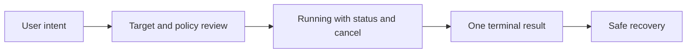
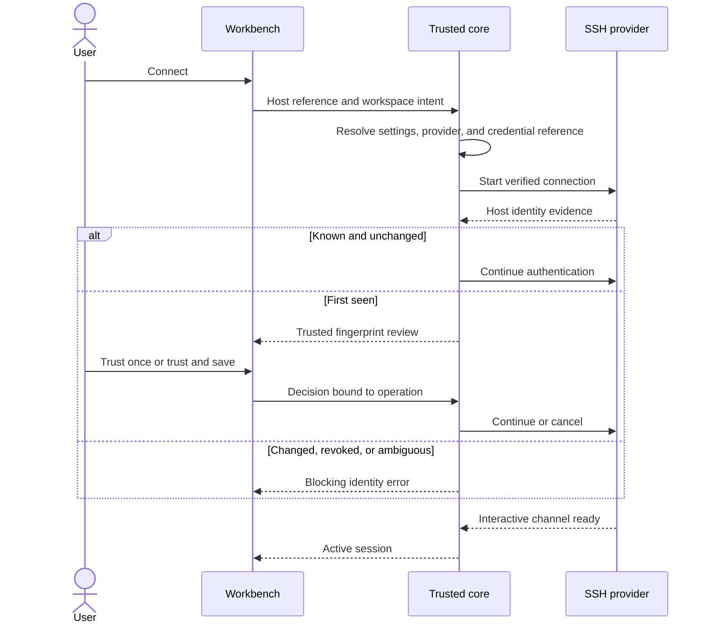

# Core User Flows

## Flow conventions

Every material operation follows the same lifecycle:



Routine actions may collapse the review step when identity and consequence are
already trusted and unchanged. First-seen identity, changed identity, broad
network exposure, overwrite uncertainty, destructive deletion, and sensitive
retention always retain an explicit review.

All flows must:

- preserve keyboard focus unless a decision requires it to move;
- show loading only after the action is accepted;
- provide cancel when the underlying operation supports cancellation;
- end in success, failure, or cancelled exactly once;
- keep secret values out of ordinary form persistence and error detail;
- retain valid non-secret form input after a recoverable error;
- use `Back` for navigation and `Cancel` for abandoning a mutation.

## 1. First launch

### User intent

Reach a useful local terminal quickly while understanding Relio’s local-first
model and security baseline.

### Default path

1. Relio opens a local welcome surface with no startup network request.
2. The surface states three commitments:
   - data remains in a local encrypted profile;
   - credentials use the OS credential store or external agent/key references;
   - remote connections happen only after user action.
3. Relio checks the platform secret store and local-shell capability.
4. If both are available, the user chooses:
   - **Open local terminal** — recommended, creates the default workspace and
     opens the detected shell;
   - **Set up an SSH host** — begins the add-host flow;
   - **Create an empty workspace** — begins workspace creation.
5. The profile is initialized only after the user selects a persistent path.
6. The workbench opens with `Personal` as the default workspace name when the
   user chose the local terminal path.
7. A non-blocking orientation callout points to the workspace switcher, command
   palette, and Add host action. It can be dismissed and is not a tour the user
   must complete.

### Secret-store unavailable

1. The welcome surface says the encrypted profile cannot open because the
   platform’s protected credential facility is locked, denied, or unavailable.
2. It offers:
   - **Try again** after the user changes OS state;
   - **View platform help** using bundled guidance;
   - **Open temporary local terminal** when the local terminal is available.
3. Temporary mode is labeled in the top bar and status bar.
4. It stores no workspace, host, history, theme, or session data and cannot
   silently convert into a persistent profile.
5. Remote credential entry is unavailable unless a supported external agent
   can authenticate without sending secret bytes through Relio.

### Acceptance criteria

- The primary action can reach a usable local prompt in one decision.
- No account, service connection, analytics consent, or theme choice interrupts
  first use.
- The user is never led to believe temporary mode persists data.
- Closing the orientation leaves all actions discoverable through the palette.

## 2. Creating a workspace

### Entry points

- `New workspace` in the Workspaces sidebar;
- `Workspace: Create` in the command palette;
- welcome screen.

### Flow

1. A focused dialog asks for:
   - name, required;
   - description, optional;
   - environment classification, optional;
   - tags, optional.
2. An optional `Add existing hosts` section searches global hosts. It creates
   references, not copies.
3. The dialog previews that a workspace is a local composition and does not own
   credentials or remote resources.
4. `Create workspace` validates and creates the aggregate.
5. Relio opens the workspace Overview with clear next actions:
   - Open local terminal;
   - Connect to host;
   - Add host.
6. Focus moves to the workspace heading and the creation is announced.

### Duplicate and failure behavior

- Names need not be globally unique; if a duplicate exists, show distinguishing
  metadata and allow it.
- Empty, control-character, oversized, or whitespace-only names fail inline.
- A persistence failure leaves the dialog open, retains valid fields, and
  identifies whether retry or profile repair is needed.

### Archive and delete follow-up

Archive is available from workspace actions and requires no destructive dialog;
it shows a short confirmation toast with `Undo` only if the archive transaction
can be reversed reliably. Delete is a separate impact-review flow and never
appears beside Archive without a destructive label.

## 3. Adding an SSH host

### Entry points

- `Add host` in Hosts;
- `Connect to host` from an empty workspace;
- command palette;
- safe-subset SSH configuration import.

### Guided flow

#### Step 1: Target

Fields:

- display name;
- hostname or address;
- port, default 22;
- username;
- optional environment, group, and tags.

The footer shows the resolved connection label such as
`deploy@api-staging.example:22`. This is display context, not a shell command.

#### Step 2: Authentication

Choose one:

- existing SSH agent identity;
- user-selected private-key file reference;
- existing stored credential reference;
- password, only when the protected helper capability is available.

The UI explains where the secret remains. It never displays or stores private
key bytes. Selecting a key file shows path, file status, and access-control
warning without copying the file.

#### Step 3: Connection path

Optional:

- jump host selected from global hosts;
- terminal profile;
- bounded keepalive and timeout controls;
- supported advanced SSH settings.

Every jump hop shows host and identity. Unsupported executable configuration
directives are never offered.

#### Step 4: Review and test

The review displays:

- exact host, port, and username;
- environment;
- provider and capability status;
- credential source;
- complete jump chain;
- workspace references to create.

`Test connection` starts the normal connection and fingerprint flow without
opening a persistent terminal. `Save and connect` saves valid metadata then
connects. `Save host` saves without network work.

### SSH configuration import

1. The user selects a file or opts into the standard user configuration.
2. Relio parses a bounded supported subset.
3. Review groups entries into:
   - ready to import;
   - requires user input;
   - blocked directives;
   - unsupported entries.
4. The user selects the ready records and resolves required fields.
5. Relio shows that source files remain unchanged.
6. Import creates host metadata only; it does not trust a new host key or
   execute configuration directives.

### Validation

Validation distinguishes invalid input, unsupported provider, unavailable
credential, blocked directive, jump cycle, and connectivity failure. A network
failure does not invalidate or discard structurally valid host metadata.

## 4. Connecting to a server

### Flow



### Interaction

1. The connect action is available from a host row, host detail, workspace
   overview, or palette.
2. When the host belongs to several workspaces, the current workspace is used;
   outside a workspace, the user chooses where to open it.
3. A new terminal surface opens immediately in a `Connecting` state showing:
   - host and environment;
   - username and credential source;
   - jump chain;
   - cancel action;
   - current phase such as Resolving, Verifying identity, Authenticating, or
     Opening terminal.
4. Credential or fingerprint decisions appear in trusted safety chrome.
5. When ready, focus moves to the terminal only if the user initiated the
   connection and has not moved focus elsewhere.
6. Success is reflected in the pane header and status bar without a modal or
   celebratory toast.

### Duplicate connection

Connecting to an already active host creates a new session after showing the
resulting session name. Relio does not assume reuse of an interactive process.
A user preference may select new tab or split destination but cannot silently
replace an active pane.

## 5. SSH fingerprint verification

### First-seen key

The trusted dialog contains:

- title: `Verify host identity`;
- statement: `Relio has not seen a key for this host and port before`;
- display name and exact hostname/address;
- port, username, environment, and jump context;
- key algorithm;
- SHA-256 fingerprint in grouped monospaced text;
- verification source and practical guidance for comparing it through a
  separate trusted channel;
- copy-fingerprint action;
- `Cancel`, `Trust once`, and `Trust and save`.

`Trust and save` is the emphasized action only after the user acknowledges that
they compared or otherwise accept the fingerprint. The control records intent;
it does not claim the comparison was independently verified.

### Changed key

The trusted dialog:

- uses title `Host identity changed`;
- shows previous and presented fingerprints with verification dates/sources;
- states that the connection is blocked;
- explains plausible causes without minimizing interception risk;
- offers `Cancel connection`, `View verification history`, and
  `Review replacement`.

Replacing the stored key is a separate high-friction flow:

1. inspect exact target and both fingerprints;
2. enter an optional local reason;
3. confirm replacement after re-authentication when policy requires it;
4. save a verification-history event;
5. start a new connection operation.

The original blocked operation cannot be approved by editing data underneath
it. Revoked, malformed, or ambiguous keys do not offer `Trust once`.

### Keyboard and accessibility

- Initial focus is on the dialog heading, then evidence, then actions.
- The fingerprint can be read as grouped text and copied without exposing any
  credential.
- `Enter` does not activate a trust action until focus is explicitly on it.
- Escape cancels the connection.
- Security severity is expressed by icon, title, text, and structure, not color
  alone.

## 6. Opening multiple sessions

### Flow

1. The user invokes `New local session` or `Connect host`.
2. Relio resolves the destination:
   - default to a new tab;
   - use the requested split direction when invoked from a split command;
   - honor a user preference only when the active layout can accept it.
3. The session receives a disambiguated name such as
   `api-staging · 2`, never a hidden duplicate.
4. The tab and pane header show state independently.
5. The palette and Sessions view list all live, connecting, disconnected, and
   restorable sessions with workspace and host context.
6. `Switch session` focuses the existing surface rather than opening a
   duplicate.

### Session limit

Before exceeding the default warning threshold, Relio shows a non-blocking
review listing live session count and estimated impact. The user may continue
within the hard runtime limit. At the hard limit, creation is blocked with
close-session remediation.

### Close behavior

Closing a live terminal surface obeys the selected session policy:

- close surface and end session;
- keep session attached elsewhere when another view owns it;
- cancel.

The dialog names the local process or remote target likely to terminate. It
does not imply that closing the view safely stops arbitrary remote work.

## 7. Using split panes

### Create

1. The user activates a pane.
2. `Split right` or `Split down` creates a sibling leaf.
3. A destination chooser offers:
   - new local terminal;
   - connect host;
   - existing session;
   - file/operation surface appropriate to context.
4. Cancel removes the empty split and restores the prior layout.

### Navigate and resize

- Directional focus shortcuts move by spatial neighbor.
- Pane header and focus ring identify the active leaf.
- Keyboard resize adjusts normalized weights in predictable increments.
- Drag resizing is constrained to usable minimum sizes.
- When space is too small, pane content may collapse secondary chrome but
  cannot hide host/environment identity or recording status.

### Close and simplify

Closing a pane removes the leaf and promotes its sibling without leaving an
empty split node. `Join all panes` moves surfaces into tabs only after a layout
preview; it does not terminate sessions.

### Restore

Relio restores the split tree and surface metadata. Unavailable sessions appear
as repairable placeholders with `Start new`, `Reconnect`, `Locate`, or `Close`
actions. No command, connection, or tunnel starts automatically.

## 8. Uploading and downloading files

### Entry points

- file-manager toolbar or context menu;
- drag from an approved local file selection into a remote directory;
- host or workspace command palette;
- terminal path action only when the path is safely resolved as data.

### Transfer review

The review shows:

- direction;
- local source/destination chosen through platform UI;
- remote host, environment, and exact path;
- authenticated identity and jump chain;
- transfer semantics: `SFTP` or `SCP-compatible transfer using verified SFTP
  semantics`;
- item count and known total size;
- overwrite policy;
- symlink handling;
- available post-transfer verification.

Relio never offers legacy SCP. If it cannot verify SFTP semantics for the
selected `scp` executable, it offers the direct SFTP workflow instead.

### Upload flow

1. Select local file(s).
2. Choose the exact remote directory and resolved destination names.
3. Relio checks existence and permissions where supported.
4. Conflicts are grouped for review: replace, rename, skip, or cancel.
5. Start transfer.
6. The Transfers panel shows bytes when trustworthy, indeterminate state
   otherwise, current item, source, destination, and cancel.
7. On completion, show verification evidence or state that it is unavailable.
8. Refresh the affected directory without changing selection unexpectedly.

### Download flow

1. Select remote item(s); directory traversal respects bounded paging and
   symlink policy.
2. Choose a local destination through the platform picker.
3. Review conflicts and partial-file behavior.
4. Start transfer and track it in the same panel.
5. On completion, offer `Reveal in folder` through a deliberate OS action.

### Interruption and retry

- Cancel reports whether a partial destination was removed, retained with a
  clear partial label, or could not be cleaned up.
- Retry creates a new operation and revalidates target, identity, paths,
  conflict, and capability.
- Relio never labels a partial file successful.
- A server that cannot report exact progress gets an indeterminate progress
  indicator with elapsed time and bytes only when known.

## 9. Editing remote files

### Open

1. From the remote browser, choose `Open as text`.
2. Relio validates that the target is a regular supported file, at most 10 MiB,
   valid UTF-8, and contains no NUL.
3. It retrieves the file over a separate authenticated SFTP connection and
   records a remote version identity.
4. A remote editor tab opens with persistent host, environment, path,
   permissions, encoding, line ending, and connection state.

Unsupported files offer Download, not an unsafe editor fallback. Relio does not
open an external editor or create a plaintext recovery draft.

### Edit and save

1. Edits remain in memory and mark the tab dirty.
2. `Save` first re-stats/re-identifies the remote target.
3. If unchanged and atomic replacement is available, the save review may be
   compact: exact target plus `Save`.
4. If the target changed, a conflict view offers:
   - compare current remote metadata/content where bounded;
   - save as another remote path;
   - discard local changes;
   - cancel.
5. If atomic replacement or metadata preservation is unavailable, trusted
   review describes the weaker behavior before any direct overwrite.
6. Successful save updates the version identity and clears dirty state.

### Close

Closing a dirty editor offers `Keep editing`, `Discard unsaved changes`, or
`Save`. It states that unsaved content exists only in memory and cannot be
recovered after discard or application termination.

On connection loss, editing may continue in memory, but Save remains
unavailable until the target is reconnected and revalidated. Relio never
silently saves to a different host or path.

## 10. Creating snippets

### Flow

1. Open Library > Snippets or invoke `Snippet: Create from selection`.
2. Enter:
   - name;
   - optional description and tags;
   - single-line command body;
   - named text parameters with label, validation, and optional non-secret
     default.
3. The editor rejects newline, NUL, escape, and terminal control characters.
4. A live preview uses clearly synthetic parameter examples.
5. The user chooses scope: user or current workspace.
6. Save returns to snippet detail with `Insert into active terminal`.

### Insert

1. Relio shows active workspace, session, target, identity, and complete
   expanded line.
2. Missing parameters are collected in a bounded prompt.
3. Secret defaults cannot be stored. Parameter values are not retained unless
   the user deliberately saves a non-secret value.
4. `Insert` places text in the active terminal input buffer.
5. Relio does not synthesize Enter, newline, or terminal control input.

If there is no active terminal, the action offers to choose an existing
terminal or cancel; it does not open and execute in a new session.

## 11. Running commands from history

The user-facing action is named `Insert from history`, not `Run`.

### Flow

1. Open history through Library, global search, or terminal history action.
2. The view states the retention scope and whether history may be incomplete.
3. Filter by workspace, host, session, time, exit metadata when available, or
   text.
4. Select a one-line entry.
5. The review shows:
   - original target and time;
   - current active target and identity;
   - full command;
   - a warning when original and current target/environment differ.
6. `Insert` validates control characters and puts the line in the active
   terminal buffer without submitting.

Multiline entries may be viewed and copied as plain text but are not eligible
for direct insertion in v1. If retention is disabled, the empty state explains
that Relio cannot reconstruct previous terminal input and links to future
retention settings without enabling them automatically.

## 12. Managing themes

### Select

1. Open Settings > Appearance.
2. Browse bundled presets and local user-created themes.
3. Preview applies inside a bounded sample workbench, not to trusted safety
   dialogs.
4. Choose global scope or current workspace where allowed.
5. Apply validates and switches atomically.
6. Failure retains the previous known-good theme and identifies invalid token
   groups.

### Create or edit

1. Duplicate a bundled preset or create from the current resolved theme.
2. Edit supported semantic groups using structured controls.
3. Contrast and terminal-palette checks update continuously.
4. The preview includes terminal, forms, file list, states, focus, and an
   immutable trusted-surface example.
5. Save draft locally; `Apply` remains unavailable when required validation
   fails.

Import and portable theme packages are unavailable in v1. Export may produce a
human-readable local reference only if later architecture explicitly allows
it; the current v1 UX provides duplicate, rename, reset, and delete, not
portable ingestion.

## 13. Managing credentials

### Credential list

Settings > Credentials shows references, not values:

- user-facing label;
- type and source;
- associated hosts count;
- availability and access-control status;
- last successful use, when retained;
- repair, rotate, or remove actions.

### Add

1. Choose Agent identity, External key file, or Stored password/passphrase when
   supported.
2. Relio explains the storage and handoff model for the chosen type.
3. Agent identity is selected from diagnosed agent metadata.
4. External key file uses the platform picker and validates regular-file and
   native permission state; Relio does not read/copy/delete the private key.
5. Stored secret uses a trusted secure-input surface and writes directly
   through the OS credential facility.
6. Associate the reference with selected hosts, then review.

### Rotate

1. Create and validate a replacement.
2. Preview affected host references.
3. Switch references transactionally.
4. Request deletion of the obsolete OS keychain item only after success.
5. Report partial deletion failure without restoring old authority.

### Remove

The impact review distinguishes:

- removing a Relio reference;
- deleting the OS keychain item;
- leaving an external key file untouched;
- hosts that will become unresolved.

No credential action displays the secret after creation. Re-authentication may
be required by the OS or safety policy.

## 14. Managing port forwards

### Create

1. Open the workspace Port forwards view or invoke `Port forward: New` from the
   command palette.
2. Choose direction:
   - **Local** — listen locally and reach a destination through the SSH host;
   - **Remote** — listen on the remote side and reach a selected local
     destination;
   - **Dynamic** — create a local SOCKS listener through the SSH host.
3. Enter the direction-specific endpoints using separate address and port
   fields. Relio never asks for an SSH command string.
4. Select the transport host, identity, jump chain, and owner workspace.
5. Use loopback as the default listening address.
6. Review a direction diagram plus exact values:

```text
Local 127.0.0.1:5433
  → SSH api-staging via bastion.example
  → database.internal:5432
```

7. `Start forward` creates one owned operation and opens the Operations panel.
8. When active, the row shows direction, listen endpoint, destination,
   transport host, loopback/broad label, owner, and Stop.

### Broad bind

Selecting a non-loopback listener opens trusted review showing:

- exact listening address and interface scope;
- which systems may be able to connect;
- destination and transport host;
- authentication/re-authentication requirement;
- explicit `Bind beyond loopback` action.

The saved form retains the broad address, but every activation follows the
current safety policy. A theme cannot weaken the `BROAD BIND` label.

### Conflict, stop, and restart

- A port conflict names the requested endpoint and states that Relio did not
  stop the existing listener.
- Relio never kills an unrelated process because it owns the same port number.
- `Stop` transitions through Stopping and confirms that the owned
  listener/process ended.
- `Restart` is an explicit stop-then-start operation and cannot create a second
  listener.
- After application restart or connection loss, a saved forward appears
  inactive with `Start again`; it never restarts silently.
- Workspace archive/delete previews active and saved forwards separately.

## 15. Managing recording controls

### Enable

1. Invoke `Session: Start recording` or use the pane recording control.
2. A trusted privacy review shows:
   - exact session and target;
   - that input/output may contain passwords, tokens, or private data;
   - encrypted local storage location category;
   - retention duration and quota;
   - current free-space reserve.
3. The user chooses session-only or workspace default when policy allows.
4. Recording begins only after confirmation.
5. A persistent icon and text-accessible status appear in the pane header and
   status bar.

### Pause, stop, and delete

- Pause and resume remain visible in the session menu and palette.
- Stop finalizes the current encrypted segment and reports failure safely.
- Delete lists selected recordings, derived indexes, and what physical secure
  deletion cannot guarantee.
- Recording is never enabled because search or history was enabled.

### Storage pressure

Warnings identify remaining safe capacity before the disk reserve is reached.
Relio stops new recording writes safely rather than consuming the reserve.
Live terminal rendering continues independently.

## 16. Handling connection errors

### Error presentation

The failed session stays in its pane with:

- concise cause;
- phase that failed;
- exact target and jump hop where safe;
- whether authentication or host identity was completed;
- what Relio stopped or cleaned up;
- primary remediation;
- Retry, Edit host, View details, and Close as applicable.

The Problems panel holds the same operation by ID. It does not duplicate a
second unrelated error.

### Error taxonomy and primary remediation

| Cause | Primary message | Useful actions |
| --- | --- | --- |
| OpenSSH absent/unsupported | SSH provider unavailable or outside tested range | Diagnose, view supported versions |
| DNS/route failure | Could not reach the resolved target | Retry, review target, view details |
| Timeout | Connection timed out during named phase | Retry, adjust scoped timeout |
| Jump-hop failure | Could not connect through named hop | Open jump host, retry |
| Agent/keychain unavailable | Selected credential source is unavailable | Unlock/repair, choose credential |
| Authentication rejected | Server rejected the selected identity | Choose credential, view safe detail |
| Unknown key | Identity needs verification | Open trusted fingerprint review |
| Changed/revoked key | Connection blocked because identity is unsafe | Review history, cancel |
| Blocked config | Unsupported or executable directive was refused | Review generated safe settings |
| Capability unavailable | Host/provider cannot perform requested feature | Use supported SFTP path or remediate provider |
| Cleanup failure | Connection ended but a child could not be confirmed stopped | View diagnostic, retry cleanup |

### Retry rules

Retry creates a new operation and revalidates provider, configuration, host
identity, credential scope, and jump chain. It never:

- falls back to another credential without selection;
- weakens algorithms;
- bypasses verification;
- switches routes;
- replays a command;
- restarts a tunnel.

### Diagnostic detail

`View details` shows typed safe metadata first. Raw provider text, when retained
locally, is secondary, clearly labeled untrusted, bounded, and redacted. Copy
diagnostic creates a preview and never includes secret values or raw session
content by default.
