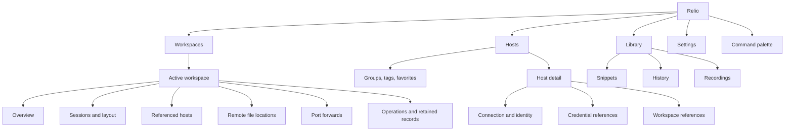
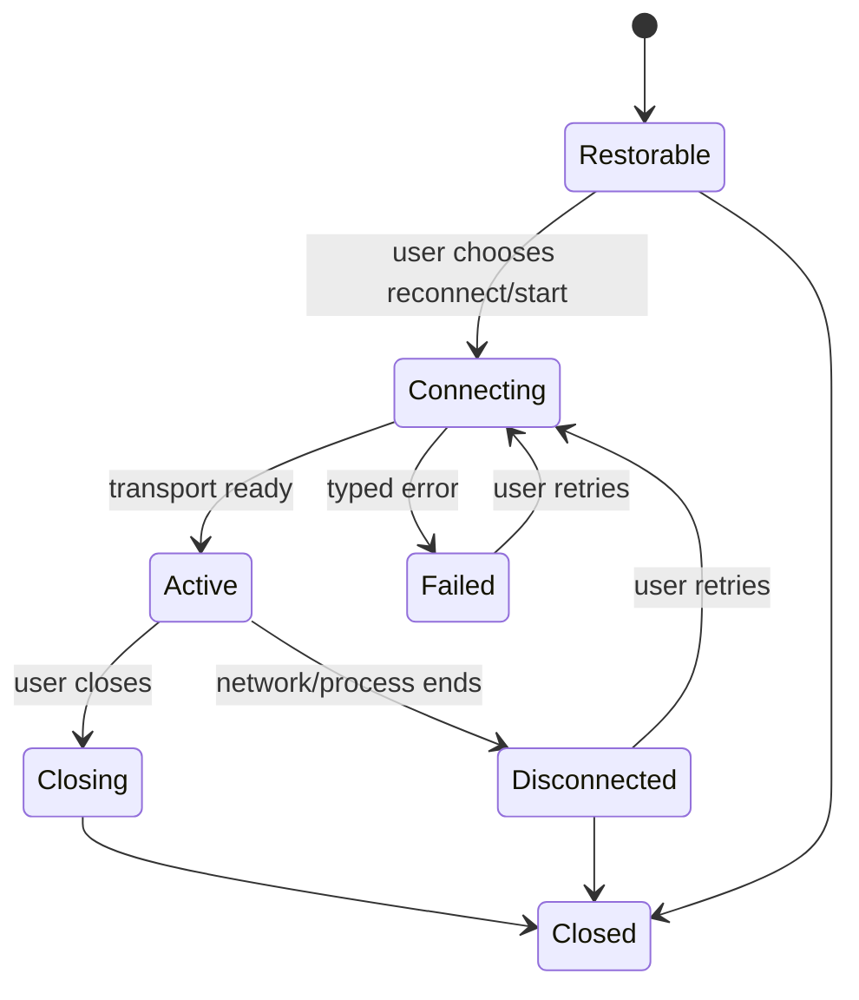

# Information Architecture

## IA goals

The application structure must:

- make workspace and target context persistent;
- support both a few hosts and a large inventory;
- separate global reusable records from workspace-owned composition;
- keep the terminal visually dominant;
- expose operations near their owner without creating a top-level item for
  every capability;
- support the same model with keyboard, pointer, and assistive technology.

## Core hierarchy



The command palette is an access layer over actions and destinations, not
another place where records live.

## Main navigation

The left activity rail has four destinations:

1. **Workspaces** — default destination and operational context.
2. **Hosts** — global inventory and connection definitions.
3. **Library** — reusable or retained local material: snippets, history, and
   recordings.
4. **Settings** — application and scoped configuration, themes, credentials,
   privacy, and diagnostics.

At the bottom of the rail:

- active operations indicator, opening the operations panel;
- profile lock/status when relevant;
- help/about entry through the application menu, not another large
  destination.

### Why four destinations

Workspaces and hosts are distinct ownership models. Library groups secondary
content that users search or reuse but do not need constantly visible.
Settings is stable and conventional. Files, sessions, transfers, tunnels, and
connection details remain contextual to a workspace or host, avoiding an
overloaded activity rail.

## Sidebar structure

The rail selects a domain. The adjacent primary sidebar changes with it.

### Workspaces sidebar

```text
WORKSPACES
  [Search workspaces]
  + New workspace

  Favorites
    Production response
    API development

  Active
    Billing service
    Personal servers

  Archived
    2026 migration
```

Selecting a workspace reveals a compact contextual section:

```text
Workspace name              [•••]
  Overview
  Sessions
  Hosts
  Remote files
  Port forwards
  Activity
```

The recent/favorite workspace list and the active workspace tools occupy the
same sidebar; they do not become two permanent sidebars. On narrow windows,
workspace tools replace the list with a clear Back to workspaces action.

### Hosts sidebar

```text
HOSTS
  [Search hosts]
  + Add host

  All hosts
  Favorites
  Recently used

  Groups
    Web
    Databases

  Environments
    Development
    Staging
    Production

  Tags
    [filterable tag list]
```

Groups are intentional organization. Tags and environments are filters.
Neither creates duplicated host records. A host can appear through several
views while keeping one global identity.

### Library sidebar

```text
LIBRARY
  Snippets
  History
  Recordings
```

Each view owns its search/filter controls. History and recordings explain when
retention is off and link to the relevant privacy setting.

### Settings sidebar

```text
SETTINGS
  Search settings
  Appearance
  Terminal
  Keyboard
  Connections
  Credentials
  Files and transfers
  History and recording
  Privacy and data
  Advanced
  About and diagnostics
```

Settings pages show scope where supported: User, Workspace, Host, or Session.
The scope selector is contextual and absent for settings that cannot use the
current scope.

## Workspace structure

A workspace is a composition, not a folder and not a credential boundary.

### Workspace overview

The overview is a launch and repair surface:

- workspace name, description, tags, and environment classification;
- pinned/recent hosts;
- restorable sessions with `Reconnect` or `Start new` actions;
- active tunnels and incomplete operations;
- unresolved host, credential, executable, or file references;
- recent local activity when retention permits it.

It does not duplicate every live terminal. The editor area retains the actual
session surfaces.

### Workspace editor

The editor area contains:

- tabs representing named layouts or single surfaces;
- a split-pane tree within each tab;
- terminal, file browser, remote editor, transfer, forwarding, log, or
  operation-detail surfaces;
- one clearly active leaf.

Closing a surface and ending its underlying session are separate when the
session can outlive the surface. The close interaction states the configured
behavior for a live process.

### Workspace lifecycle

| Action | Meaning |
| --- | --- |
| Create | Create an empty local composition with optional template-like layout choices built into Relio |
| Rename | Change label only; stable identity and references remain |
| Archive | Hide from active lists and disable automatic restoration |
| Delete | Remove workspace-owned records after impact review |

Deleting a workspace does not delete global hosts, OS credentials, external key
files, local downloaded files, or remote resources. The impact preview names
each category.

## Host organization

### Host list

The default host table columns are:

- favorite and connection status;
- display name;
- address summary;
- username;
- environment;
- group/tags;
- last connection result and time;
- credential status.

Sensitive address display may be hidden with privacy mode, but the exact target
must be visible before connection.

### Host detail

Host detail uses sections rather than a long edit form:

1. **Overview** — effective address, port, username, environment, provider, and
   capability diagnosis.
2. **Authentication** — agent/key/password reference and status, never secret
   value.
3. **Connection path** — jump chain, proxy constraints, keepalive, and terminal
   profile.
4. **Host identity** — known key, fingerprint, source, verification history,
   and exceptions.
5. **Workspaces** — all references with aliases/roles.
6. **Advanced** — safe supported SSH subset and scoped exceptions.

Primary actions are Connect, Open files, and More. Edit is explicit; viewing a
host does not place all metadata in editable controls.

### Add/import behavior

`Add host` opens a guided connection dialog. Import from user-selected SSH
configuration is a branch of this flow, not a permanent top-level destination.
The import review:

- parses only the supported safe subset;
- lists accepted and blocked directives;
- never edits the source file;
- creates global host records only after confirmation.

## Session management

### Session states



`Restorable` means metadata and layout are available. It never implies process
resurrection. Reconnect creates a new transport and never replays commands or
restarts tunnels silently.

### Session identity

Each terminal surface shows:

- user-facing session name;
- local or SSH type;
- host and environment for remote sessions;
- username/identity;
- state;
- recording state when enabled.

Full connection detail belongs in the inspector and is reachable by keyboard.

### Tabs and panes

Tabs organize broad tasks; panes support simultaneous comparison. Both use
stable accessible names. Pane actions always name or visually mark the target
pane.

The active pane, selected navigation item, and active tab are separate states.
Changing the sidebar selection must not unexpectedly redirect terminal input.

## Operation and transfer organization

The bottom panel contains:

- **Operations** — active and recent connect/save/tunnel tasks;
- **Transfers** — uploads/downloads with source, destination, semantics,
  progress, cancel, and result;
- **Problems** — typed failures and repair actions.

The status bar shows compact counts and the highest-priority current state.
Selecting an item opens its detail without stealing terminal input until the
user explicitly moves focus.

Completed items follow bounded retention. The panel is not an unbounded event
log and does not imply that session recording is active.

## Settings organization

| Page | Contents | Reason |
| --- | --- | --- |
| Appearance | Theme, density, UI font, motion | Common visual choices together |
| Terminal | Font, size, cursor, scrollback, copy/paste behavior | Terminal-specific behavior without mixing transport |
| Keyboard | Shortcuts, conflicts, terminal interception policy | One authoritative shortcut model |
| Connections | Provider diagnosis, SSH defaults, timeouts, keepalive | Transport configuration and capability status |
| Credentials | Secure-store status, references, agent identities, rotation/removal | Security-sensitive records get a dedicated surface |
| Files and transfers | Download destination, overwrite defaults, concurrency | Remote I/O policy |
| History and recording | Opt-in retention, quotas, segment deletion | Sensitive retention controls stay visible |
| Privacy and data | Data locations, exports, deletion, offline mode | Makes local-first behavior inspectable |
| Advanced | Narrow supported expert controls and scoped legacy exceptions | Prevents rare controls from crowding defaults |
| About and diagnostics | Version, platform capability report, local logs/export | Repair and support without built-in upload |

### Setting row anatomy

Every setting row includes, when relevant:

- name and concise consequence;
- effective value;
- source scope;
- inherited, explicit, or policy-constrained state;
- reconnect/restart effect;
- reset at current scope;
- validation or unavailability reason.

## Search model

Relio has three distinct search scopes:

1. **Command palette:** actions and destinations.
2. **Global search:** local retained metadata across workspaces, hosts,
   snippets, history, and recordings the user has enabled.
3. **In-surface find:** terminal scrollback, current file, host list, or
   settings page.

The UI labels the scope and never implies that unrecorded terminal output can be
found globally.

## Routing rationale

- A host is global because multiple workspaces may reference it.
- A credential is managed globally because it is protected outside a
  workspace, but use remains target- and operation-bound.
- Files and tunnels are contextual because their meaning depends on a host and
  workspace.
- History, snippets, and recordings share a library because they are searched
  and reused rather than continuously navigated.
- Operations use a panel because lifecycle feedback should remain visible
  without displacing the main task.
- Themes live in Appearance because they change presentation, not product
  behavior or application authority.
