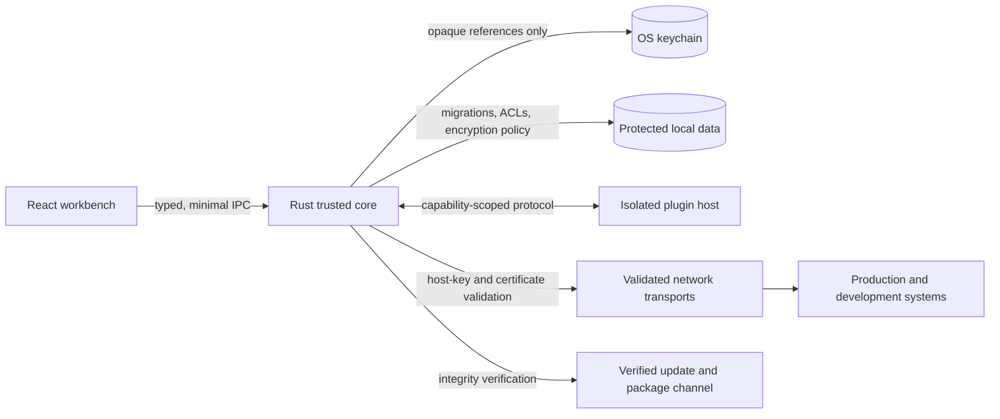

# Relio Security Architecture

Security is a core product pillar of Relio. Relio must be treated as a security-sensitive infrastructure management application because users may connect to production environments and store highly sensitive credentials.

Every architectural decision must consider:

- confidentiality;
- integrity;
- availability;
- least privilege;
- secure defaults;
- attack-surface reduction.

## Security principles

- Secure by default.
- Zero-trust assumptions between the UI, core, plugins, local data, and remote systems.
- Least privilege with explicit, reviewable capabilities.
- No unnecessary telemetry.
- Privacy first and local-first operation.
- Explicit user consent for trust, credential use, network exposure, and external operations.
- Security must not be traded for convenience.

## Security architecture

The UI is not a credential store. Plugins are not trusted with core authority. Remote output is data, not an instruction to the application. The OS keychain owns credential material; Relio stores references and metadata only.

## Security documents

- [Threat model](threat-model.md)
- [Credential security](credentials.md)
- [SSH security](ssh.md)
- [Plugin security](plugins.md)
- [Local data security](local-data.md)
- [Network security](network.md)
- [Supply-chain security](supply-chain.md)
- [Secure development and responsible disclosure](secure-development.md)

## Security status

These documents define the architecture and acceptance criteria before implementation. They are not a certification, penetration-test report, or guarantee that the eventual implementation is secure. Security-sensitive behavior requires tests, review, and evidence in the relevant pull request.

## Review triggers

Require a security review when changing authentication, host-key handling, secret storage, plugin capabilities, update verification, remote file writes, port binding, AI context flow, telemetry, diagnostic collection, or data migrations involving sensitive content.
