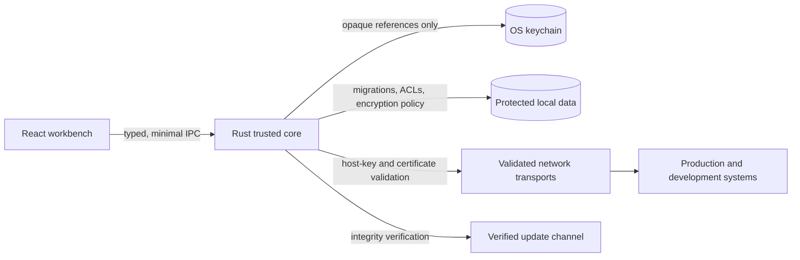

# Relio Security Architecture

Security is a core product pillar of Relio. Relio must be treated as a security-sensitive infrastructure management application because users may connect to production environments and store highly sensitive credentials.

Every architectural decision must consider:

- confidentiality;
- integrity;
- availability;
- least privilege;
- secure defaults;
- attack-surface reduction.

## Security principles

- Secure by default.
- Explicit trust boundaries: the Rust core is trusted authority; the webview,
  themes, SSH configuration, remote systems, terminal output, and external
  content are less trusted or untrusted.
- Least privilege with explicit, reviewable capabilities.
- No unnecessary telemetry.
- Privacy first and local-first operation.
- Explicit user consent for trust, credential use, network exposure, and external operations.
- Security must not be traded for convenience.

## Security architecture

The UI is not a credential store. Remote output and imported data are not
instructions to the application. The OS secret facility protects credentials
and profile root keys; Relio stores opaque references and encrypted metadata.
All v1 application behavior is compiled, reviewed, signed, and released as one
product.

## Security documents

- [Threat model](threat-model.md)
- [Credential storage](credentials.md)
- [Secret management](secrets.md)
- [SSH security](ssh.md)
- [Local database security](local-data.md)
- [Encryption strategy](encryption.md)
- [Network security](network.md)
- [Update security](updates.md)
- [Supply-chain security](supply-chain.md)
- [Secure development lifecycle and responsible disclosure](secure-development.md)
- [Privacy principles](privacy.md)

## Security status

These documents define the architecture and acceptance criteria before implementation. They are not a certification, penetration-test report, or guarantee that the eventual implementation is secure. Security-sensitive behavior requires tests, review, and evidence in the relevant pull request.

## Review triggers

Require a security review when changing authentication, host-key handling,
secret storage or leases, encryption formats or keys, frontend IPC exposure,
update verification, remote file writes, port binding, command execution,
recording, product analytics, diagnostic collection, or data migrations
involving sensitive content.

## Security release blockers

No stable public release may proceed without:

- a private vulnerability-reporting channel with named ownership;
- protected application/update signing ownership and rehearsed recovery;
- encrypted-profile behavior on all Tier 1 platforms;
- hostile terminal/config/theme, host-key, askpass, IPC, update, and migration
  negative tests;
- SBOM, provenance, artifact signatures, and published checksums;
- an independent review of the IPC, credential, SSH, update, remote-file,
  recording, and encryption boundaries.
